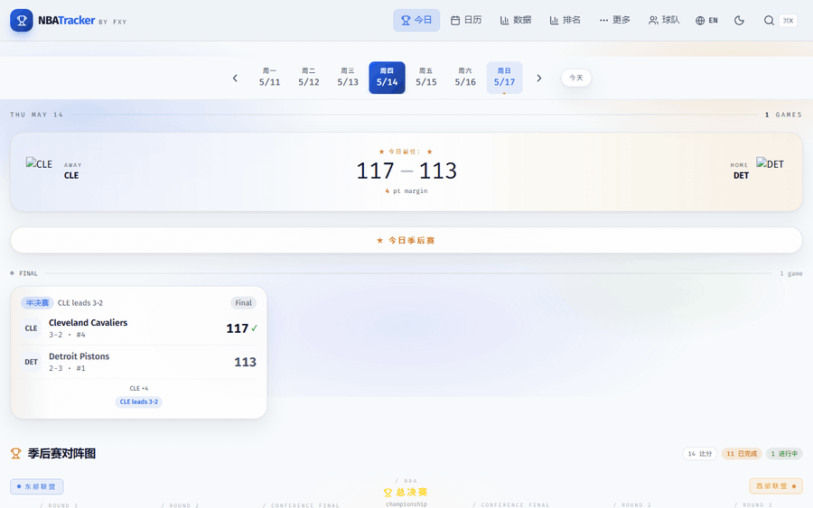
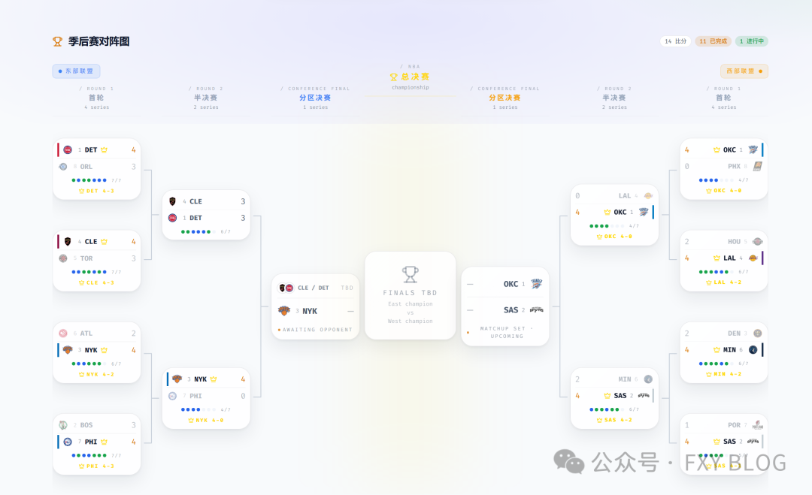
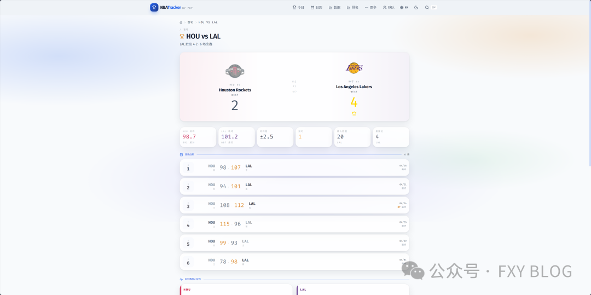
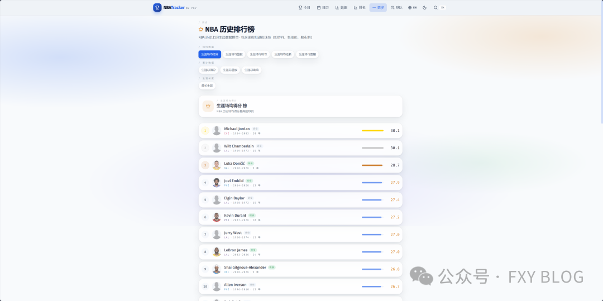
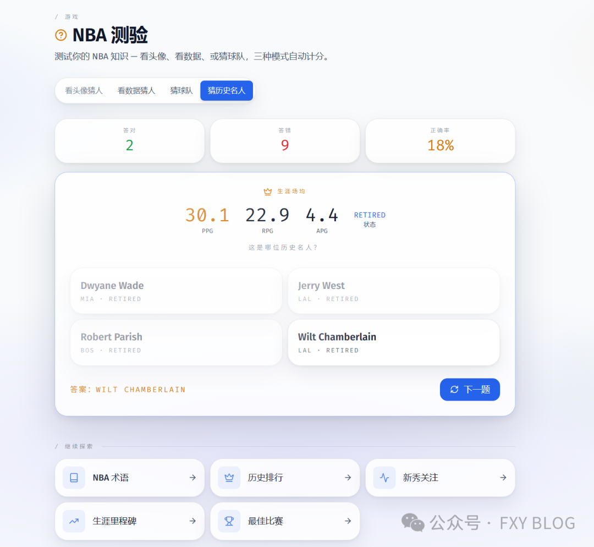
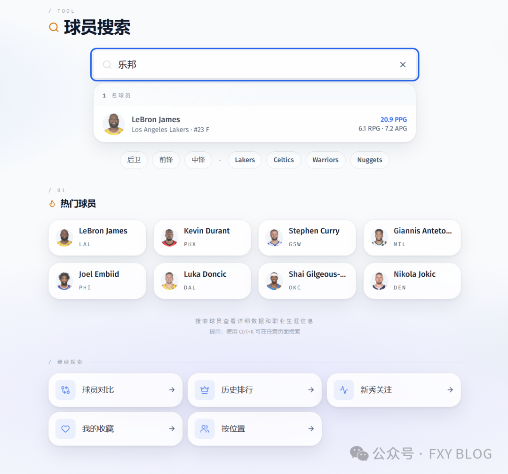
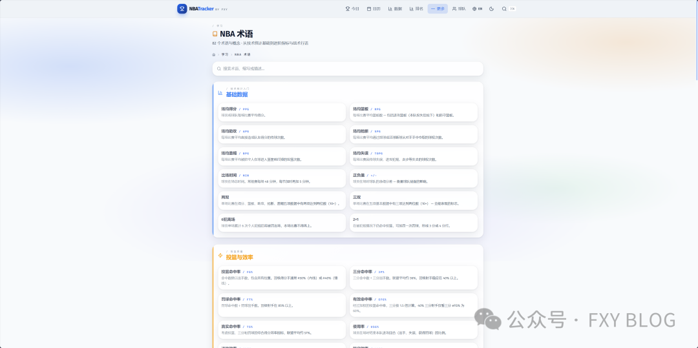
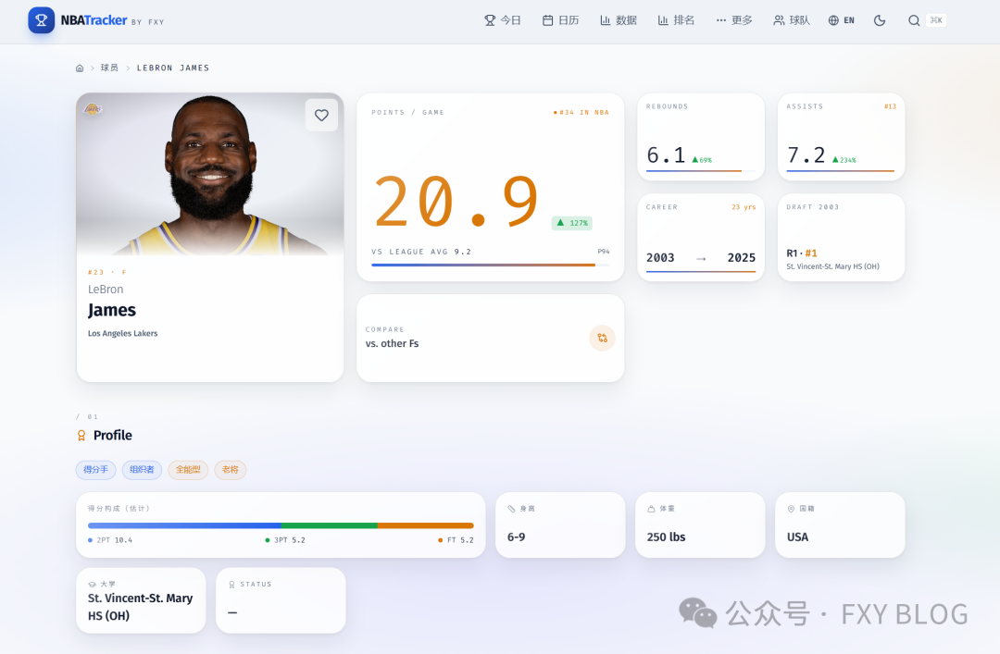
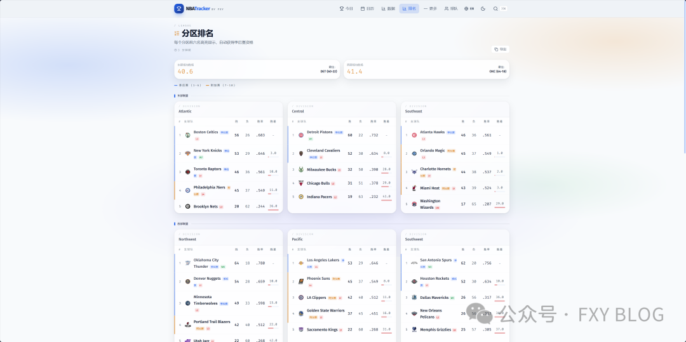
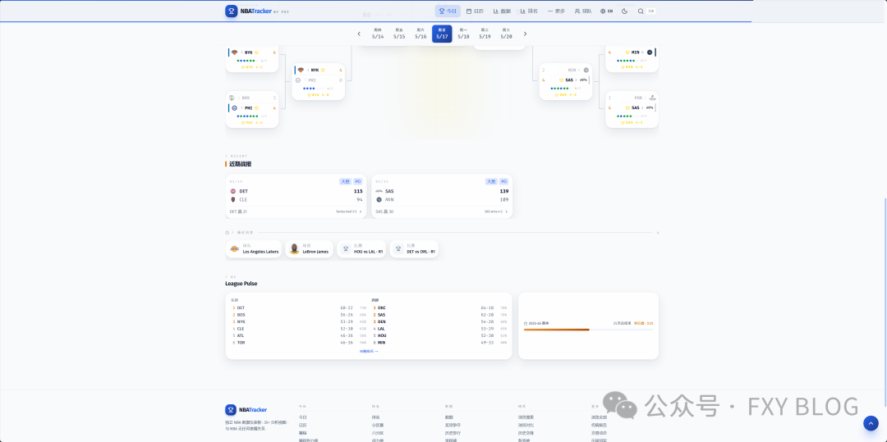

<div align="center">

# NBA Tracker

**Real-time NBA scores, stats, analytics, and shot charts — built with Next.js 16 & React 19.**

[](https://vercel.com/new/clone?repository-url=https%3A%2F%2Fgithub.com%2Ffxy2026%2Fnba-tracker&env=BALLDONTLIE_API_KEY,NEXT_PUBLIC_SUPABASE_URL,NEXT_PUBLIC_SUPABASE_ANON_KEY,ADMIN_PASSWORD&envDescription=API%20keys%20needed%20for%20full%20functionality.%20Only%20BALLDONTLIE_API_KEY%20is%20required%2C%20others%20are%20optional.&project-name=nba-tracker&repository-name=nba-tracker)

[Live Demo](https://nba.xpy.me) &nbsp;|&nbsp; [Tech Article](https://www.xpy.me/article/nba-tracker)


</div>

---



> **2026-05 update**: full UI rebuild + ~50 commits of polish — bracket → tree structure, top menu → Command Palette, breadcrumbs + RelatedPages on every page, A11y/WCAG AA, true PWA (offline + install), Service Worker, bilingual zh/en, Web Vitals telemetry, modern web platform (Speculation Rules · Container Queries · `:has()` · scroll-driven animations), data accuracy fixes (real all-time career leaders), code-split refactors (BracketTree 911 → 163, game/[id] 1026 → 243). See [`docs/2026-05-update.md`](docs/2026-05-update.md) for the full story, [the article](https://www.xpy.me/article/nba-tracker) for the narrative.

## Highlights

- **46 routes** — every angle of the season (standings, power-rankings, streaks, momentum, tier-list, awards-race, all-time-leaders, milestones, records, this-day, …)
- **Real-time game tracking** — 30s auto-refresh on homepage, 15s on game detail, live score flash animation
- **True PWA** — installable, offline-capable via Service Worker, iOS + Android adaptive icons
- **Bilingual (zh / en)** — every page translated, cookie-persisted, full Hupu-style basketball terminology in Chinese
- **A11y first** — focus traps on modals, aria-labels on every icon button, SVG charts with `role="img"`, 44px touch targets
- **Modern web platform** — Speculation Rules predictive prefetch, scroll-driven CSS progress bar, `:has()` parent-aware hover, container queries on adaptive cards
- **Data freshness pills** — every cache-backed page shows "X minutes ago" so users know how fresh the numbers are
- **Search with 230+ aliases** — "字母哥" → Giannis, "King James" → LeBron, "Lakers" → entire roster
- **100% discoverability** — every detail/analytic page has a `<RelatedPages>` footer; zero dead ends
- **Recently viewed** — last 8 player/team/game visits surfaced on homepage

## Features

| Page family | Routes | Notes |
|-------------|--------|-------|
| **Live & detail** | `/`, `/game/[id]`, `/player/[id]`, `/team/[tricode]`, `/series/[id]` | Server components, dynamic-import for heavy charts |
| **League state** | `/standings`, `/conference-race`, `/divisions`, `/power-rankings`, `/tier-list`, `/streaks`, `/momentum` | Schedule-derived, freshness pill |
| **Awards & leaders** | `/stats`, `/awards-race` (with rookie filter), `/all-time-leaders` (real career data), `/milestones` (projections), `/clutch`, `/best-games`, `/records` | Mix of live + curated static data |
| **Players** | `/search`, `/compare`, `/h2h`, `/rookie-watch`, `/draft-classes`, `/by-position`, `/by-country`, `/by-college` | Bilingual search aliases |
| **Schedule** | `/calendar`, `/schedule`, `/schedule-heatmap`, `/back-to-back`, `/game-predictor` | Timezone-aware grouping (user's local TZ) |
| **News & meta** | `/injuries`, `/transactions`, `/history`, `/rivalries`, `/scoring-output`, `/home-vs-road`, `/this-day` | ESPN + balldontlie sources |
| **Fan tools** | `/favorites`, `/quiz` (incl. Legend mode), `/glossary` (82 terms, zh+en) | localStorage favorites + recently viewed |

### Notable engineering

| | |
|---|---|
| **Pure-SVG shot chart** | Coordinate transform (NBA API axes inverted), Bezier 3-point arc, 2PT/3PT/miss markers |
| **Auto-narrative game summary** | Detected lead changes, scoring runs (8-0+), clutch shots, quarter MVP, biggest run, AST/TO efficiency |
| **Playoff bracket** | True tree diagram with SVG connectors; partial projections for in-progress matchups; pre-fills advanced teams |
| **In-memory schedule cache** | 11 MB JSON cached with stale-while-revalidate + mutex; cold start dedupes concurrent fetches |
| **`fetchWithRetry`** | Exponential backoff, 5xx-only retry, console.error on terminal failure |
| **Web Vitals telemetry** | LCP/INP/CLS/FCP/TTFB logged with rating colors, rolling buffer in localStorage |

## Screenshots

### v2 — May 2026 redesign

| | |
|:---:|:---:|
|  |  |
| Playoff Bracket — tree structure with SVG connectors + partial projections | Series Detail — game-by-game · top performers · key moments |
|  |  |
| All-Time Leaders — real career data (Jordan 30.12 PPG, not last-season averages) | Legend Quiz — guess the GOAT from career stats |
|  |  |
| Search 230+ aliases — "字母哥" → Giannis, "司机" → Nowitzki, "湖人" → roster | Glossary — 82 basketball terms with Hupu-style Chinese |
|  |  |
| Breadcrumbs + "X minutes ago" freshness pill on every page | RelatedPages footer — every analytic page links to 5-6 siblings |
|  |  |
| Scroll-driven CSS progress bar (pure CSS, zero JS) | Recently viewed — last 8 player/team/game visits on homepage |

<details>
<summary><b>Click to expand original feature screenshots</b></summary>

| | |
|:---:|:---:|
|  |  |
| Game Detail — Scoreboard | Game Detail — Box Score |
|  |  |
| Shot Chart — pure SVG basketball court | Play-by-Play Timeline |
|  |  |
| Player Profile | Stats Leaders |
|  |  |
| Division Standings | Team Page |
|  |  |
| Calendar | Injury Report |
|  |  |
| Player Search | History |
|  |  |
| Game Detail — Mobile | Homepage — Mobile |

</details>

## Architecture

```
src/
├── app/                            # Next.js 16 App Router — 46 routes
│   ├── page.tsx                    # Homepage — Server + 30s ISR
│   ├── game/[id]/                  # ✂ split into _components/ (13 files)
│   │   ├── page.tsx                # 243 lines (composer)
│   │   └── _components/            # GameHero, GameLeaders, GameHeadlines …
│   ├── player/[id]/                # next/dynamic for 6 heavy subcomponents
│   ├── team/[tricode]/              # ✂ 295-line composer + 6 _components
│   ├── series/[id]/                 # Playoff series deep-dive
│   ├── all-time-leaders/            # Career data — STATIC (NBA legends)
│   ├── glossary/, quiz/, …          # 46 total routes
│   └── api/                         # 16 route handlers
│       ├── games/, standings/       # Server-cached, retry-aware
│       ├── search/                  # 230+ player aliases (zh + en)
│       └── …
├── components/                      # 71 components
│   ├── bracket/                     # ✂ Split from 911-line BracketTree
│   ├── player/                      # Player-page subcomponents
│   ├── ShotChart, KeyMoments, …     # Game charts (pure SVG)
│   ├── ToastProvider                # Global toast (createPortal)
│   ├── ThemeScript                  # Inline-head FOWT killer
│   ├── SpeculationRules             # Prefetch + prerender hints
│   ├── SwRegister                   # Service Worker mount
│   ├── WebVitalsReporter            # LCP/INP/CLS telemetry
│   ├── InstallPrompt                # PWA install banner (incl. iOS hint)
│   ├── OnlineStatus                 # Offline/online banner
│   ├── RecentlyViewed               # Last 8 visited details
│   └── …
└── lib/                             # 20 modules
    ├── api.ts                       # NBA CDN client, fetchWithRetry, cache
    ├── playoffs.ts                  # Bracket pure helpers (extracted)
    ├── game-stats.ts                # Game-page narrative helpers
    ├── team-rank.ts                 # Conference rank helper
    ├── allTimeLeaders.ts            # 45 NBA legends (static career data)
    ├── playerAliases.ts             # 230+ search aliases
    ├── timezone.ts                  # localTz, dateInTz, localToday
    ├── teamUrls.ts                  # CDN URL builders
    ├── games.ts                     # gameId predicates + winPct
    ├── recentlyViewed.ts            # localStorage visit tracker
    └── …
```

### Key technical decisions

- **Data source**: NBA CDN (`cdn.nba.com/static/json/`) — free, no API key. `stats.nba.com` is CORS-blocked from Vercel IPs, so career-historical data is bundled statically.
- **11 MB schedule cache**: In-memory stale-while-revalidate + mutex; cold-start callers share one Promise.
- **Dual-tier polling**: 30s homepage, 15s game detail via `router.refresh()` — no page reload.
- **Timezone-aware grouping**: Calendar + DateNav + `/api/games` group games by user's local IANA timezone (via `Intl.DateTimeFormat().resolvedOptions().timeZone`) instead of NBA's ET. A 7pm ET game on May 15 shows on the May 16 cell for a Beijing user — matching their lived experience.
- **Service Worker**: Bucketed strategies — network-first for HTML, cache-first for `_next/static`, stale-while-revalidate for cdn.nba.com images. Versioned caches with activate-time purge.
- **Code-split heavy charts**: `next/dynamic` for ShotChart, ShotHeatmap, PlayByPlay, RadarChart, ScoringFlow, WinProbability, PlayerShotChart so the game-page bundle stays lean.
- **Static all-time leaders**: NBA's playerIndex only includes active players and serves last-season averages. A real career leaderboard (Jordan 30.12 PPG, Wilt 22.9 RPG, Magic 11.19 APG, Stockton 15,806 career assists, …) is hand-curated in `lib/allTimeLeaders.ts`.

## What's new (2026-05 update)

50+ commits across these tracks (see [`docs/2026-05-update.md`](docs/2026-05-update.md) for the full story):

| Track | Highlights |
|-------|------------|
| **Reliability** | `error.tsx` siblings on 5 detail routes · `fetchWithRetry` with backoff · `getScheduleAge()` + `<UpdatedPill>` freshness chips on 17 pages · Cache-Control: no-store on every 500 response |
| **Discoverability** | `<Breadcrumbs>` + `<RelatedPages>` on every detail + analytic page — 100% coverage, zero dead ends · 230+ search aliases in zh & en · "Recently viewed" tracker |
| **A11y (WCAG AA)** | Focus trap + restoration on CommandPalette + Teams modal · aria-labels on all icon-only buttons · `role="img"` + summary on every SVG chart · CommandPalette input labelled |
| **Mobile** | Tiny text bumped (text-[8-10px] → text-[11-12px] on mobile only) · 44px touch targets · iOS `env(safe-area-inset-top)` sticky · Swipe Y-axis guard prevents accidental date flips |
| **i18n** | `/about` + `/explore` + `/clutch` + `/rookie-watch` + `/milestones` + `/awards-race` fully translated · Glossary 47 → 82 terms with Hupu-style Chinese · Search filters both languages |
| **Modern web** | Speculation Rules predictive prefetch (Chrome 122+) · `text-wrap: balance` on headings · `:has()` parent hover · Container queries on cards · CSS scroll-driven progress bar (Chrome 115+) |
| **PWA** | Service Worker with bucketed caches · `<InstallPrompt>` for Chrome/Edge/Android · iOS Safari "Add to Home Screen" hint · `<OnlineStatus>` offline/online banner · Maskable + apple-touch icons |
| **Code quality** | BracketTree.tsx **911 → 163** lines · game/[id]/page.tsx **1026 → 243** · team/[tricode]/page.tsx **786 → 295** · 11 new lib modules extracting 80+ duplicate sites |
| **Data accuracy** | `/all-time-leaders` replaced with real career data · `/rookie-watch` keyed by draftYear · `/milestones` relabeled as projections · `/awards-race` ROY tab now actually filters rookies · `by-X` pages note "last season" |
| **Polish** | Global `<ToastProvider>` for action feedback · Flash-of-wrong-theme killed via inline ThemeScript · `prefers-color-scheme` auto-detect · System-aware meta theme-color · Web Vitals reporter |

## Getting started

### Prerequisites

- Node.js 18+
- npm / pnpm / yarn

### 1. Clone & install

```bash
git clone https://github.com/fxy2026/nba-tracker.git
cd nba-tracker
npm install
```

### 2. Environment variables

Copy `.env.example` to `.env.local` and fill in:

```bash
cp .env.example .env.local
```

| Variable | Required | Description |
|----------|----------|-------------|
| `BALLDONTLIE_API_KEY` | Yes | Free key from [balldontlie.io](https://www.balldontlie.io/) |
| `NEXT_PUBLIC_SUPABASE_URL` | Optional | Supabase project URL (for replay links) |
| `NEXT_PUBLIC_SUPABASE_ANON_KEY` | Optional | Supabase anon key |
| `ADMIN_PASSWORD` | Optional | Password for the `/admin` replay management page |

> The core features (scores, box scores, shot charts, standings, analytics) work without any API keys — they use the free NBA CDN.

### 3. Run

```bash
npm run dev
```

Open [http://localhost:3000](http://localhost:3000).

### 4. Build

```bash
npm run build      # Production build (Turbopack)
npm run lint       # ESLint with react-hooks strict rules
```

## Tech stack

| Layer | Technology |
|-------|-----------|
| Framework | Next.js 16.2 (App Router + experimental.viewTransition) |
| UI | React 19 (Server Components, `use()` hook, async transitions) |
| Language | TypeScript 5 (strict mode, zero `any` in new code) |
| Styling | Tailwind CSS 4 — `@theme inline`, `:has()`, container queries |
| Icons | Lucide React |
| Database | Supabase (PostgreSQL) — optional, for replay links |
| Data | NBA CDN + ESPN injuries + BallDontLie |
| Deploy | Vercel (edge + Node runtime mix) |
| Telemetry | `next/web-vitals` — local logs + localStorage buffer |

## Stats

```
30,000+ lines of hand-written TypeScript/TSX
71      React components
46      pages (46 routes)
16      API routes
20      lib modules
82      glossary terms (zh + en)
230+    player search aliases
~5s     production build (Turbopack)
0       lint errors, 0 type errors
```

## Deploy

[](https://vercel.com/new/clone?repository-url=https%3A%2F%2Fgithub.com%2Ffxy2026%2Fnba-tracker&env=BALLDONTLIE_API_KEY,NEXT_PUBLIC_SUPABASE_URL,NEXT_PUBLIC_SUPABASE_ANON_KEY,ADMIN_PASSWORD&envDescription=API%20keys%20needed%20for%20full%20functionality.%20Only%20BALLDONTLIE_API_KEY%20is%20required%2C%20others%20are%20optional.&project-name=nba-tracker&repository-name=nba-tracker)

## License

MIT
