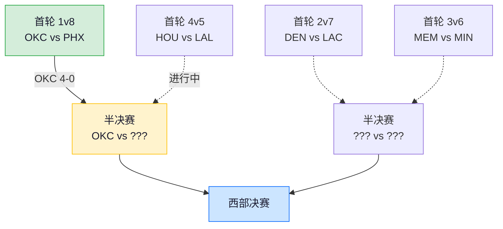
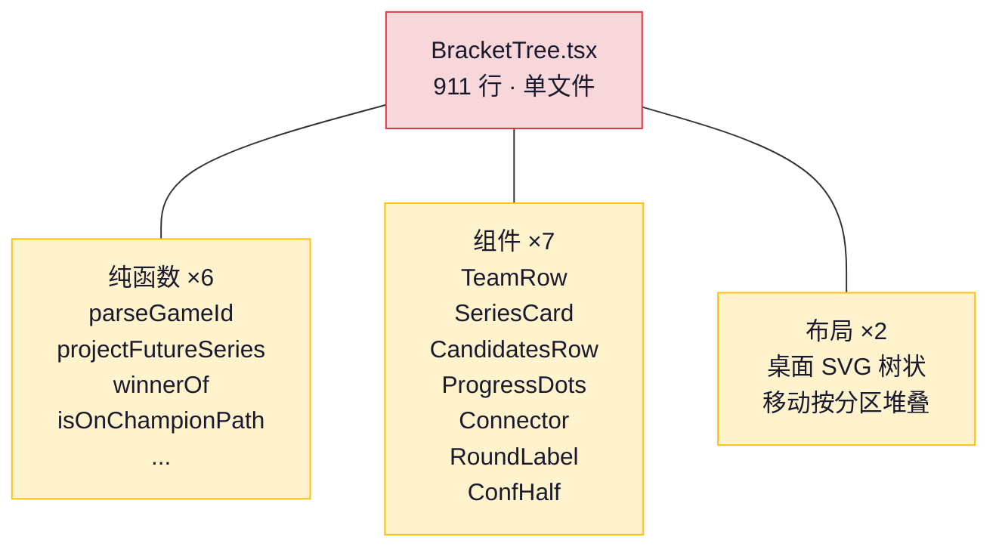
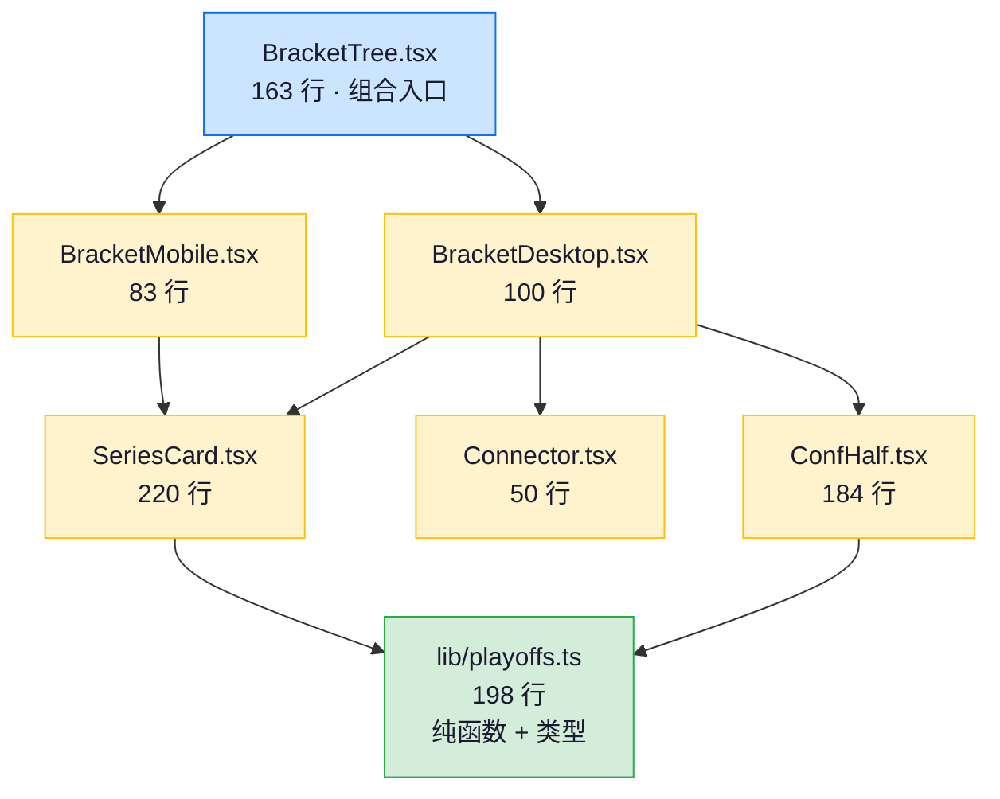
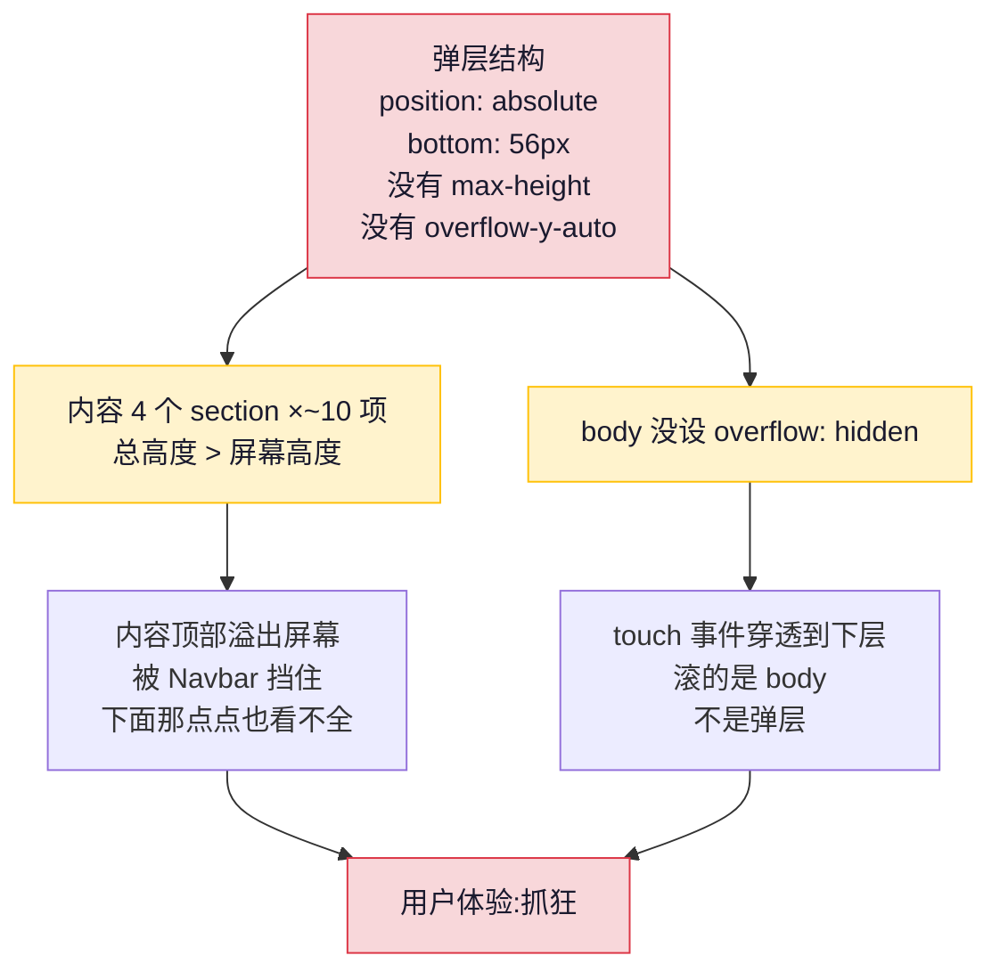
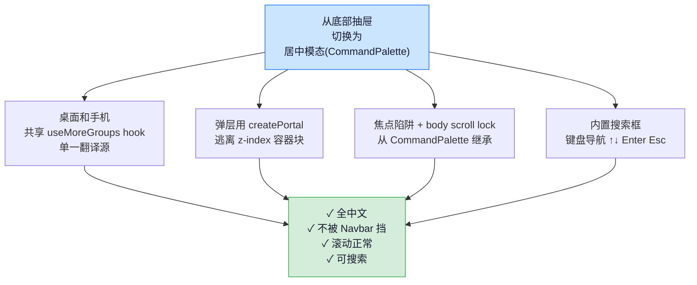
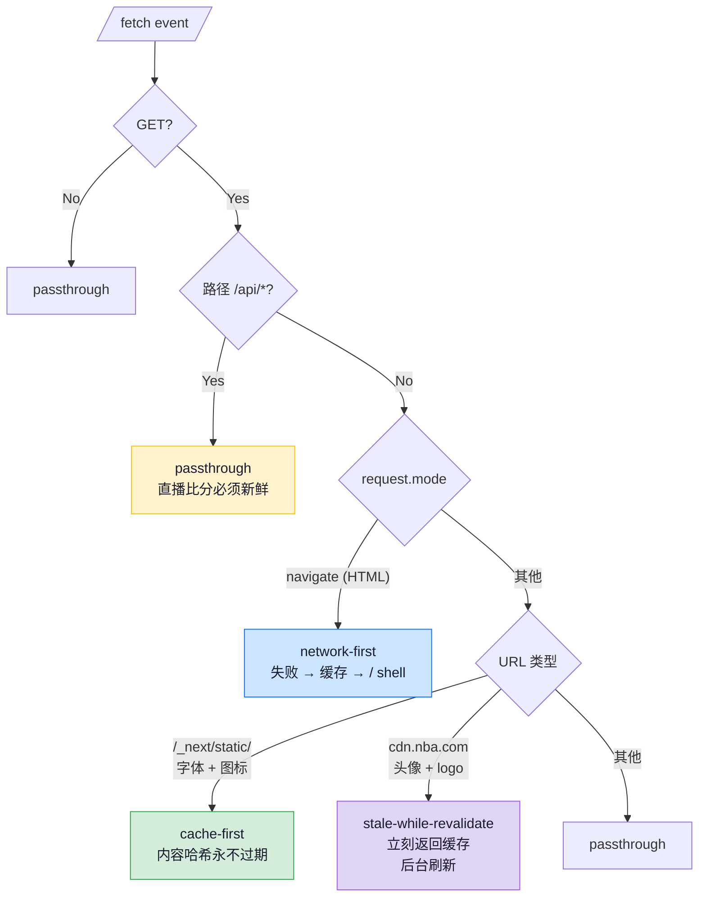
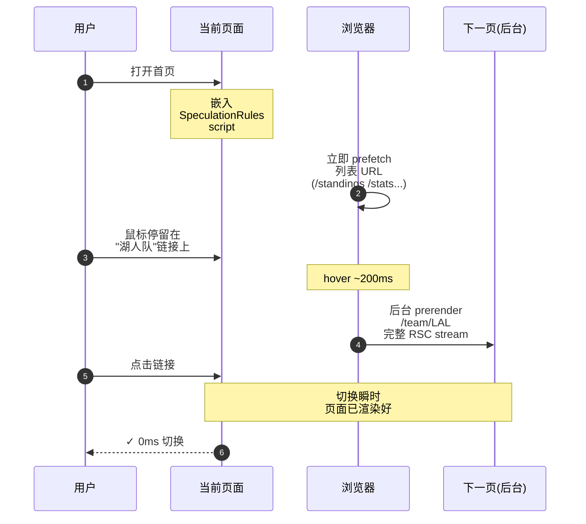
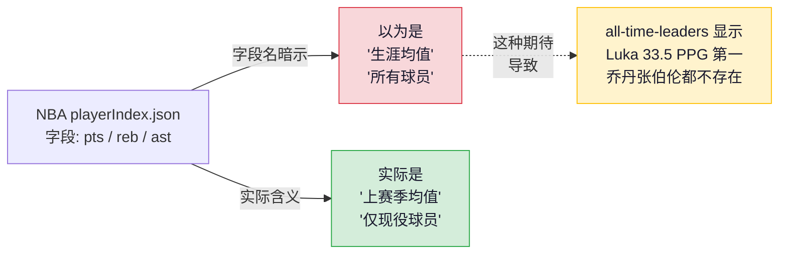
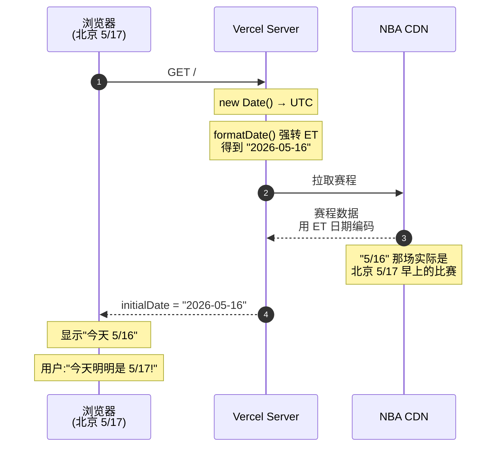
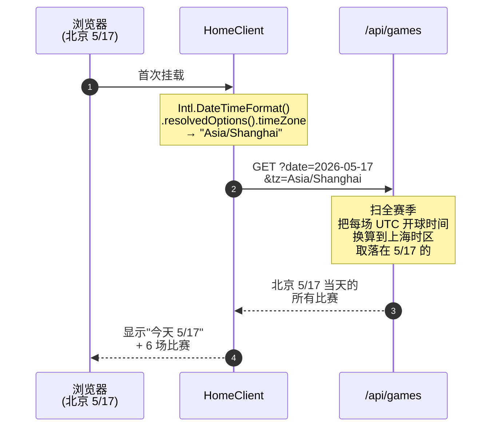

<!--
=========================================================================
 稀土掘金 (Juejin) 优化版 — 直接复制粘贴到 Markdown 编辑器即可

 标题:     我重写了一个 NBA 数据网站 — 8800 行到 30000 行做了什么
 分类:     前端
 标签:     前端 / Next.js / React / PWA / TypeScript
 封面图:   https://nba.xpy.me/article-images/30-bracket-tree.png
 摘要:     对阵图改成树状结构、菜单换成 Command Palette、装到主屏断网能用、
          搜"乐邦"返回詹姆斯——一次 UI 大改造的全记录。30000 行代码、
          46 个页面、10 张架构图。

 操作:
   1. https://juejin.cn/editor/drafts/new
   2. 编辑器右上角切换到 Markdown 模式
   3. 复制 "=== 正文开始 ===" 到 "=== 正文结束 ===" 之间的内容
   4. 上方填好标题、摘要、封面图、标签
   5. 预览 → 发布

 Juejin 原生支持 mermaid 渲染，所以本文 mermaid 图表用源码块而非 PNG。
=========================================================================
=== 正文开始 ===
-->


> 一次时区 bug，让我把整个项目重写了一遍。从 8800 行到 30000 行，46 个页面，10 张架构图。

## 🎯 本文你会看到

- **UI 改造的全流程**：对阵图怎么从堆叠卡片变成树状结构，顶部菜单为什么换成 Command Palette，详情页加了什么细节
- **拆分 911 行单文件组件的实战**：BracketTree.tsx 怎么拆成 7 个文件，从"打开就头晕"变成"单元认知负担可控"
- **现代 Web 平台真实使用案例**：Speculation Rules、`:has()` 选择器、滚动驱动动画、容器查询——以前要 JS 才能做的事，现在 CSS 一行搞定
- **Service Worker 分桶缓存**：装到主屏的 PWA + 断网能用的真离线
- **数据准确性陷阱**：为什么我的"NBA 历史排行榜"第一名居然是 Luka Dončić 而不是乔丹
- **几个工程教训**：field 的名字 ≠ field 的含义，小 bug 是冰山

📦 技术栈：**Next.js 16 · React 19 · Tailwind 4 · TypeScript 5 · Service Worker · Puppeteer (用于自动化 demo 录制)**

🔗 线上演示：[nba.xpy.me](https://nba.xpy.me) · 完整源码：[github.com/fxy2026/nba-tracker](https://github.com/fxy2026/nba-tracker)

---

## 起因

[上一篇](https://www.xpy.me/article/nba-tracker)写到 NBA Tracker 第一版：8800 行、16 个页面、纯 SVG 投篮图、Suspense 流式渲染。当时的目标是把功能堆起来——比分、Box Score、投篮图、季后赛对阵——能跑就行。

跑了一段时间之后，越用越觉得糙。不是哪一处特别坏，而是处处差一口气：

- 季后赛对阵图是垂直堆叠的大卡，看不出 1v8 / 4v5 的层级
- 球队页的点差走势图配色像 PPT 默认样式
- 顶部菜单的下拉框内容多了之后会**溢出屏幕外**，根本点不到
- 手机端的「更多」弹层撑出屏幕，按住屏幕滚动的居然是下层页面

这些都不是阻断功能的 bug，但每次打开都膈应。

直到我在 Claude Code 的 skill 库里看到一个叫 **UI/UX Pro Max** 的 skill——专门做大厂级别的 UI 审计和重构建议。试着让它扫了一遍站点，回来一份清单：30+ 个具体问题，从间距、字号、配色到信息架构。

于是有了这次重写。

---

## 一、对阵图：从堆叠卡片到树状结构

第一版的季后赛对阵图是按"轮"竖着堆 8 个系列的卡片，看不出 4 对阵的层级关系——你看不出 OKC 打的是太阳还是火箭，因为它们都只是排在第一轮的某个位置。

UI/UX Pro Max 给的建议：

- 用真正的**树状结构**，SVG 连接线把上一轮的胜者连到下一轮
- 用**进度点**显示系列赛打了几场（best of 7，1-0 / 2-0 / 4-0）
- 已经晋级的球队**预先填到**下一轮的位置——OKC 4-0 横扫之后，下一轮"OKC vs ???"直接标出来



每个系列卡片可以点进去，跳到独立的系列赛详情页（这是新加的路由）：


页面包含逐场战果、双方场均、最大胜差、关键球员排行——把整个 best-of-7 拍扁到一个页面看。

### 拆掉 911 行的怪物

UI 重写需要触碰原来的 `BracketTree.tsx`——911 行单文件。打开就头晕：



React 组件、纯函数、桌面布局、移动布局全混在一起。任何一处微调都要在 900 多行里找位置。

UI/UX Pro Max 的建议里有一条**隐含的工程要求**：视觉结构应该映射到代码结构。一个 series card 就该有一个 `SeriesCard.tsx`；一组 SVG 连接线就该有一个 `Connector.tsx`。

拆完变成 7 个文件：



**拆分原则**：

- **纯函数下沉到 `lib/`**：无 React、无 JSX 的代码全部抽到 `lib/playoffs.ts`，纯 TS
- **一个组件一个文件**：SeriesCard / Connector / ConfHalf / BracketMobile / BracketDesktop
- **视觉零变化**：CSS 类名、prop 形状一个字符都不改

同样的思路套到 `game/[id]/page.tsx`（**1026 行 → 243 行** + 13 个 `_components/`）和 `team/[tricode]/page.tsx`（**786 行 → 295 行** + 6 个 `_components/`）。

> 🎯 **Next.js 的 `_components/` 约定**：下划线开头的文件夹不会被识别为路由。只在某个页面用到的子组件就该和它一起住，不污染全局 `src/components/` 命名空间。

拆分的收益**不是行数减少**——是单元的认知负担降低。以后维护这个区域不需要把 900 行装进脑子。

---

## 二、顶部菜单：从下拉框到 Command Palette

第一版的顶部「更多」按钮是个 hover 出来的下拉框。问题是数据多了之后，菜单太长——浏览器视口不够高的时候，下面那截直接被屏幕底部截断，**点都点不到**。

UI/UX Pro Max 的建议：**改成 Command Palette 风格的居中模态**。原因：

- 不依赖锚点定位，永远居中显示
- 内容多了自带滚动条，不会被截断
- 可以加搜索框（输入"战力"立刻定位到"战力榜"）
- 键盘导航（↑↓ Enter Esc）天然友好

实现要点：用 `createPortal` 把模态挂到 `document.body`，逃离 Navbar 的 containing block；搜索过滤用 O(1) Map 而不是每次 `indexOf`。焦点陷阱（Tab/Shift+Tab 在模态里循环）和打开时 body scroll lock 也一起做了。

桌面端搞定之后，手机端也是同一个问题。

### 手机端「更多」的修复

手机底栏的「更多」按钮原本弹出的是个底部抽屉。在手机上点开发现——弹层顶部撑到了状态栏，下面那点点也看不全。手指按住屏幕想往下滚，**结果滚的是下层页面**，弹层本身一动不动：



更深的问题是**两套实现两套翻译**：桌面 Navbar 的「更多」菜单已经全中文翻译完了，手机的 MobileNav 重新写了一套**英文硬编码**版本。维护两份必然漂移。

修法：抽到共享 hook，桌面手机都用同一个 CommandPalette：



`src/lib/useMoreGroups.ts` 成为单一数据源：

```typescript
export function useMoreGroups(): PaletteGroup[] {
  const { t, locale } = useLocale();
  const isZh = locale === "zh";

  return useMemo<PaletteGroup[]>(() => [
    {
      title: isZh ? "联赛排序" : "League Order",
      eyebrow: isZh ? "排名" : "Standings",
      color: "#FFD700",
      items: [
        { href: "/conference-race", label: isZh ? "分区赛" : "Conference Race", icon: Trophy },
        { href: "/divisions", label: isZh ? "六分区" : "Divisions", icon: MapIcon },
        { href: "/power-rankings", label: isZh ? "战力榜" : "Power Rankings", icon: Crown },
        // ...
      ],
    },
    // ... 4 个分类共 35 个链接
  ], [t, isZh]);
}
```

桌面 Navbar 和手机 MobileNav 都 `const moreGroups = useMoreGroups();`，传给同一个 `<CommandPalette>` 组件。

修弹层本身的细节：

```typescript
// Body scroll lock — iOS Safari 会高高兴兴地穿透弹层滚下层页面
useEffect(() => {
  if (!moreOpen) return;
  const prev = document.body.style.overflow;
  document.body.style.overflow = "hidden";
  return () => { document.body.style.overflow = prev; };
}, [moreOpen]);
```

几个细节：

- `100dvh` 而不是 `100vh`：动态视口高度，会考虑浏览器地址栏
- `env(safe-area-inset-bottom)`：iOS 刘海屏的底部安全区
- `overscrollBehavior: contain`：阻止滚动链——弹层滚到底再继续滑不会传到 body
- `touchAction: pan-y`：允许垂直拖动，禁止水平滑动

副作用是删了 88 行重复代码。

---

## 三、详情页布局：信息层级和留白

球员页 / 球队页 / 比赛页是站点流量最高的三个详情页。UI/UX Pro Max 审完给了几个共性的反馈：

- **顶部要有 breadcrumbs**：用户进来之前是从哪里来的，不要让他用浏览器回退
- 每个数据 section 要有"路标"：左侧 1px 高 3px 宽的小竖条 + 9px 字号的眉头（"/ Box Score" 这种），不抢主信息但能让眼睛分清楚
- **底部要有"继续探索"卡片**：5-6 个相关链接，让用户不会撞墙
- **数据新鲜度要可见**：每页标题下显示"X 分钟前更新"


实现一个 `<PageHeader>` 接受可选的 `updatedAt` prop，下面挂一个 `<UpdatedPill>` 实时更新：

```typescript
interface PageHeaderProps {
  eyebrow?: string;
  icon?: LucideIcon;
  title: string;
  subtitle?: string;
  action?: React.ReactNode;
  updatedAt?: number | null;  // ms since data was fetched
}
```

`updatedAt` 接收 `getScheduleAge()` 的返回值（schedule cache 距今 ms 数）。挂到 17 个 schedule-derived 页面后，用户在每页标题下都能看到"X 分钟前更新"——对实时性的预期被校准。

新加 `<Breadcrumbs>` 和 `<RelatedPages>` 两个共享组件，应用到 **33 个详情和分析页**：

```tsx
// 详情页顶部
<Breadcrumbs items={[
  { label: round.full, href: "/" },
  { label: `${team1.tricode} vs ${team2.tricode}` },
]} />

// 详情页底部
<RelatedPages
  eyebrow={isZh ? "继续探索" : "Keep exploring"}
  pages={[
    { href: `/team/${home}`, label: "球队主页", icon: Users },
    { href: `/h2h?t1=${home}&t2=${away}`, label: "历史交锋", icon: GitCompareArrows },
    // ... 5-6 个上下文相关链接
  ]}
/>
```

**100% 覆盖**意味着：用户在任意一个数据视图都能跳到相关的 4-6 个视图。SEO 也会受益——内部链接图密度上升。

---

## 四、首页：滚动条 + 最近浏览 + 数据流标识

UI/UX Pro Max 对首页的建议很具体：

- **顶部加 2 像素滚动进度条**，跟着滚动位置走，给长页面一个进度感
- **保留访问历史**：把用户最近浏览的球员 / 球队 / 比赛缩到首页中部一条横向滚动
- **第一次访问的人看不到访问历史块**——空状态不显示


进度条用纯 CSS 滚动驱动动画实现：

```css
.scroll-progress-rail::after {
  content: "";
  display: block;
  height: 100%;
  background: var(--gradient-accent);
  transform-origin: 0 50%;
  animation: scroll-progress-grow linear;
  animation-timeline: scroll(root);  /* ← 关键 */
}
@keyframes scroll-progress-grow {
  from { transform: scaleX(0); }
  to { transform: scaleX(1); }
}
```

**零 JS、零 scroll listener、零 jank**。Chrome 115+ 原生支持，老浏览器静默忽略——进度条不显示，但不报错。

之前类似效果需要：

```javascript
window.addEventListener("scroll", () => {
  const progress = window.scrollY / (document.body.scrollHeight - window.innerHeight);
  bar.style.transform = `scaleX(${progress})`;
}, { passive: true });
```

每次滚动事件都触发布局抖动。CSS 自己搞定后，浏览器优化掉合成层。

最近浏览的实现：localStorage 存最近 12 条访问，每个详情页挂一个零 UI 的 `<RecentVisitTracker>`：

```typescript
// src/lib/recentlyViewed.ts
export function recordVisit(kind: RecentKind, id: string, label: string): void {
  const items = read();
  const filtered = items.filter((it) => !(it.kind === kind && it.id === id));
  const next: RecentItem = { kind, id, label, ts: Date.now() };
  const sameKind = filtered.filter((it) => it.kind === kind).slice(0, 11);
  const otherKinds = filtered.filter((it) => it.kind !== kind);
  write([next, ...sameKind, ...otherKinds].sort((a, b) => b.ts - a.ts));
}
```

首页有 `<RecentlyViewed>` 横向滚动条显示最近 8 条。**首次访问时 localStorage 空，整个组件 `return null`，不显示空状态——避免空状态比展示空状态体面**。


---

## 五、现代 CSS：那些以前要 JS 才能做的事

UI/UX Pro Max 的几条建议涉及现代 CSS 能力，这几年的浏览器普及度已经够了。

### `text-wrap: balance`

```css
h1, h2, h3 { text-wrap: balance; }
p { text-wrap: pretty; }
```

让标题断行时计算最佳分布，避免"最后一行就一个字"。一行 CSS，全站质感拉满。Chrome 114+ / Edge 114+ / Safari 17.4+ 已支持。

### `:has()` 选择器

之前要做"父元素响应子元素状态"必须 JS：

```jsx
<div className={isChildHovered ? "active" : ""} onMouseEnter={...}>
  <Link onMouseEnter={() => setIsChildHovered(true)}>...</Link>
</div>
```

现在 CSS：

```css
/* 卡片含 Link/Button 在 hover 时整张卡片提亮 */
.glass-tile:has(a:hover),
.glass-tile:has(button:hover) {
  border-color: var(--border-strong);
  box-shadow: var(--shadow-elevated);
}

/* 卡片内任意子元素 focus-visible 时显示焦点环 — 键盘用户友好 */
.glass-tile:has(:focus-visible) {
  outline: 2px solid var(--accent);
  outline-offset: 2px;
}
```

Chrome 105+ / Edge 105+ / Safari 15.4+ / Firefox 121+ 支持，覆盖率足够。

### 容器查询

```css
.cq-grid > * { container-type: inline-size; }

@container (max-width: 320px) {
  .glass-tile.cq-adapt { padding: 12px; }
  .glass-tile.cq-adapt > .cq-row {
    flex-direction: column;
    gap: 8px;
  }
}
```

同一个卡片放在三列网格里和放在单列侧栏里自动呈现不同密度。区别于 media query：**媒体查询跟视口走，容器查询跟父容器宽度走**。

---

## 六、PWA：装到主屏 + 离线能用

UI/UX Pro Max 对 PWA 的清单：manifest 完整化、安装提示、离线指示器、Service Worker 真离线。

### Service Worker 分桶缓存

`public/sw.js` 按请求类型分桶缓存：



代码：

```javascript
self.addEventListener("fetch", (event) => {
  const req = event.request;
  if (req.method !== "GET") return;

  const url = new URL(req.url);
  if (url.pathname.startsWith("/api/")) return;  // 实时数据不拦截

  if (req.mode === "navigate") {
    event.respondWith(
      fetch(req)
        .then((res) => {
          if (res.ok) caches.open(CACHE_PAGES).then((c) => c.put(req, res.clone()));
          return res;
        })
        .catch(() => caches.match(req).then((c) => c || caches.match("/")))
    );
    return;
  }

  // _next/static 走 cache-first，cdn.nba.com 走 SWR...
});
```

设计要点：

- **`/api/*` 永远 passthrough**：直播比分不能缓存
- **HTML network-first + 离线 shell fallback**：在线时永远拿新数据；断网时拿缓存或 `/` 首页
- **`_next/static/` cache-first**：Next 构建的资源 URL 带内容哈希，可以无限期缓存
- **图片 stale-while-revalidate**：先显示缓存，后台刷新
- **版本化缓存**：`CACHE_VERSION = "v1"`，每次 breaking change bump。activate 时清掉旧版本，避免新部署后老 chunk 僵尸服务

iOS Safari 特殊处理：那个浏览器**永远不会触发** `beforeinstallprompt`。所以 InstallPrompt 组件做 UA 检测，遇到 iOS 不显示 Install 按钮，改为弹引导："点击 Safari 分享按钮 → 添加到主屏幕"。

### Speculation Rules：预测性导航

Chrome 122+ 加了新 API，能告诉浏览器哪些 URL 值得预先 prefetch 或者 prerender：



```tsx
const rules = {
  prefetch: [
    { source: "list", urls: ["/", "/standings", "/stats", "/search", "/calendar"] },
  ],
  prerender: [
    {
      source: "document",
      where: {
        and: [
          { href_matches: "/*" },
          { not: { href_matches: "/admin*" } },
          { not: { href_matches: "/api/*" } },
        ],
      },
      eagerness: "moderate",  // hover ~200ms 时 prerender
    },
  ],
};

return <script type="speculationrules" dangerouslySetInnerHTML={{ __html: JSON.stringify(rules) }} />;
```

两个层级：

- **prefetch**：固定的 5 个高频入口一次性 prefetch
- **prerender + `eagerness: "moderate"`**：鼠标 hover 200ms 后浏览器在后台 prerender 任意站内非 /admin 非 /api 链接

不支持的浏览器忽略整个 script tag，零副作用。比手写 `Link.prefetch` 强一档。

---

## 七、数据准确性陷阱：playerIndex 在骗你

UI 改完之后，开始有人能注意到数据层面的问题——以前 UI 太糙，没人能看清数据本身错没错。

打开 `/all-time-leaders`，按"生涯场均得分"排序。前几名：

```
1. Luka Dončić    33.5 PPG
2. SGA            31.1
3. Anthony Edwards 28.8
```

但 NBA 历史上能场均超过 30 分的只有两个人：乔丹 30.12、张伯伦 30.07。Luka 上赛季 33.5 是他**一个赛季**的数据，不是生涯。

排查代码，数据源是 NBA CDN 的 `playerIndex.json`，取 `pts/reb/ast` 三个字段：



两个隐藏坑：

- `playerIndex` **只包含现役球员**。乔丹 2003 年退役不在里面，张伯伦 1973 年退役更不在
- `pts` 字段是球员**上一个完整赛季的场均**，不是生涯均值

`stats.nba.com` 的历史职业端点被 CORS 卡死，Vercel IP 也被拒，走 API 路径不通。最后的修法：**手工录入静态历史榜单**：

```typescript
// src/lib/allTimeLeaders.ts
export const ALL_TIME_LEADERS: AllTimeLeader[] = [
  { personId: 0, name: "Michael Jordan", fromYear: 1984, toYear: 2003, active: false, team: "CHI",
    ppg: 30.12, rpg: 6.2, apg: 5.3, spg: 2.3, bpg: 0.8,
    totalPts: 32292, totalReb: 6672, totalAst: 5633, totalStl: 2514 },
  { personId: 0, name: "Wilt Chamberlain", fromYear: 1959, toYear: 1973, active: false, team: "LAL",
    ppg: 30.07, rpg: 22.9, apg: 4.4,
    totalPts: 31419, totalReb: 23924, totalAst: 4643 },
  // ... 共 45 条
];
```


类似的"标签 vs 数据"不一致还在 5 个页面里发现：

| 页面 | 错误标签 | 实际数据 | 修法 |
|------|---------|---------|------|
| `/rookie-watch` | "本赛季新秀" | 上赛季新秀 | 按 draftYear 过滤 + 显式说明 |
| `/milestones` | "Career Milestones" | 用上赛季均推算的生涯总和 | 改名"生涯轨迹追踪"，明确是投影 |
| `/awards-race` ROY | "Rookie of the Year" | 所有联赛球员（老兵霸榜） | 加 rookie 过滤器 |
| `/by-position/country/college` | 球员场均 | 上赛季均值 | 标签后加"· 上赛季"限定 |

⚠️ Bug 让用户感知到问题（页面挂了）。**标签错了让用户带着错误信息走**。后者更难发现，影响更大。

---

## 八、时区：一个 bug 渗透到全栈

修 UI 期间发现的另一个深层问题。中国用户北京时间 5/17 早上 10 点打开网站，看到顶部写着"今天 5/16"：



直接原因：NBA 官方赛程用美东时间编码。北京时间凌晨开打的比赛，在赛程数据里写的是前一天。但服务端代码强转 ET 算"今天"，于是中国用户看到的"今天"是 ET 的今天（北京的昨天）。

修法：把"用户的本地时区"当成 first-class concept 沿请求链一路传：

```typescript
// src/lib/timezone.ts
export function localTz(): string {
  try {
    return Intl.DateTimeFormat().resolvedOptions().timeZone || "America/New_York";
  } catch {
    return "America/New_York";
  }
}

export function dateInTz(d: Date, tz: string = localTz()): string {
  return new Intl.DateTimeFormat("en-CA", {
    timeZone: tz,
    year: "numeric", month: "2-digit", day: "2-digit",
  }).format(d);
}
```

然后 `/api/games` 接受 `?tz=Asia/Shanghai`，扫全赛季日程，把每场比赛的 UTC 开球时间换算到用户时区，看它落在哪一天。修完之后的数据流：



修复扩散到 `DateNav.tsx`、`GamesList.tsx`、`/api/calendar`、`/app/calendar/page.tsx` 等多处。两个分离的概念不能混：

- **"NBA 的今天"**：ET today。用于 live scoreboard endpoint
- **"用户的今天"**：local tz today。用于显示哪一格高亮、`/api/games?date=` 该取哪天的比赛

---

## 九、搜索：用 230+ 别名兜底中文外号

第一版搜"字母哥"返回 0 结果。

UI 上"搜索"是用户最高频的入口之一，但只能搜英文罗马名是个硬伤——中文外号、英文外号、传奇球员的中英文称谓、球队名都应该能搜到。

新加 `src/lib/playerAliases.ts`，**230+ 条别名映射**：

```typescript
export const PLAYER_ALIASES: Record<string, string> = {
  // 中文外号
  "字母哥": "antetokounmpo",
  "大胡子": "harden",
  "司机": "nowitzki",
  "蚂蚁": "anthony edwards",
  "胖虎": "williamson",
  "乐邦": "lebron james",
  "詹皇": "lebron james",
  // 英文外号
  "king james": "lebron james",
  "greek freak": "antetokounmpo",
  "chef curry": "curry",
  // 传奇
  "乔丹": "michael jordan",
  "篮球之神": "michael jordan",
  "曼巴": "bryant",
  "黑曼巴": "bryant",
  // ... 230+ 条
};

export function expandQuery(qLower: string): string[] {
  const expansions = new Set<string>();
  expansions.add(qLower);
  const exact = PLAYER_ALIASES[qLower];
  if (exact) expansions.add(exact);
  for (const key of Object.keys(PLAYER_ALIASES)) {
    if (qLower.includes(key)) expansions.add(PLAYER_ALIASES[key]);
  }
  return [...expansions];
}
```

`/api/search` 用 `expandQuery()` 把查询展开成多个候选词，OR 起来匹配。另外加了**球队名直搜**——搜"湖人"或"Lakers"返回整队现役球员：

```typescript
const matchedTeams = new Set<string>();
for (const [tri, meta] of Object.entries(TEAM_META)) {
  const haystack = `${meta.city} ${meta.name} ${tri}`.toLowerCase();
  if (queries.some((qq) => haystack.includes(qq))) matchedTeams.add(tri);
}
```


---

## 十、词汇表 + Quiz：内容深度

`/glossary` 第一版只有英文。扩到 **82 个词条**，全部翻译成虎扑式中文（"协防 / 护框者 / 退守战术 / 横扫 / 附加赛 / 双双 / 三双 / 接球投篮"），加了"阵容与战术"和"交易与名单"两个新分类：


`/quiz` 第一版有 3 个模式：看头像猜人 / 看数据猜人 / 猜球队。加了第 4 个："**猜历史名人**"。从那 45 位 GOAT 里随机出题，给生涯均值让你 4 选 1：


看到一组 `30.07 / 22.9 / 4.4 / 退役` 能马上认出是张伯伦——22.9 篮板是大杀器，除了张伯伦只有比尔拉塞尔 22.5。

---

## 数据对比：从第一版到现在

| 指标 | 第一版 | 现在 |
|------|-------|------|
| 代码行数 (TS/TSX) | 8,800 | **30,000+** |
| 路由 | 16 | **46** |
| React 组件 | 39 | **71** |
| API endpoint | 13 | **16** |
| lib 模块 | ~5 | **20** |
| 词汇表条目（中英） | 47 | **82** |
| 球员搜索别名 | ~0 | **230+** |
| 有 RelatedPages 的页面 | 4 | **33（100%）** |
| 有 Breadcrumbs 的页面 | 1 | **24** |
| 有 error.tsx 的路由 | 1 | **6** |

体验层面：

- 装到主屏 → 断网能看 → 联网无感更新
- 中英双语全覆盖，搜索支持中英文别名 + 球队名直搜
- A11y 焦点陷阱 / aria-label / SVG `role="img"` / 屏幕阅读器友好
- 44px 触控目标 + iOS 安全区 + 反穿透
- 33 个数据页底部都有"继续探索"，没死胡同
- 滚动条 / "X 分钟前"标签 / 最近浏览 / Toast 反馈 / Web Vitals 监控

---

## 八条工程教训

写到最后，挑几条印象最深的：

1. **field 的名字 ≠ field 的含义**。一个叫 `pts` 的字段可能是生涯均值，可能是上赛季，也可能是当前赛季。名字从来不会告诉你它实际是什么——永远验证 schema。
2. **小 bug 是冰山**。手机端「更多」菜单滚不动这种小问题，往往挂着 body scroll lock 缺失、max-height 没设、overscrollBehavior 没配置、两套实现两份翻译漂移**一整套问题**。
3. **本地时区是 first-class concept**。函数签名上写出来，不要让"哪个 timezone"成为隐含的、由调用者随机决定的参数。
4. **拆分的最大收益不是行数减少**。是单元的认知负担降低——以后维护这个区域不需要把 900 行装进脑子。
5. **CSS 已经能做你以为只能 JS 做的事**。`:has()`、容器查询、滚动驱动动画、`text-wrap: balance` 都是这两年的新能力。别再写 scroll listener 算进度条了。
6. **Service Worker 不可怕**。坚持几个原则：`/api/*` 不拦截 / HTML network-first / hashed static 永久缓存 / 版本化 purge。
7. **PWA 是免费的护城河**。一份代码同时是网站 + iOS app + Android app + 桌面 PWA。
8. **标签错比 bug 还可怕**。Bug 是用户能感知到问题。标签错是用户带着错误信息走。

---

## 现在试试

线上地址：**[nba.xpy.me](https://nba.xpy.me)**

代码（完全开源）：**[github.com/fxy2026/nba-tracker](https://github.com/fxy2026/nba-tracker)**

试试这些：

- [/all-time-leaders](https://nba.xpy.me/all-time-leaders) 切换"生涯总得分" → 看到詹姆斯 42184 / 贾巴尔 38387 / 卡尔马龙 36928
- [/glossary](https://nba.xpy.me/glossary) 切中文 → 82 个篮球术语全中文
- [/search](https://nba.xpy.me/search) 输入"字母哥"或"乐邦" → 立即命中
- 任意比赛/球员/球队详情页底部 → "继续探索"卡片
- 手机访问 → 顶部"安装到主屏"按钮 → 加到主屏
- 装好后断网刷新 → 仍能看到首页 shell + 顶部红条提示离线

---

## 🙏 如果觉得有用

- ⭐ **GitHub 给个 Star**：[github.com/fxy2026/nba-tracker](https://github.com/fxy2026/nba-tracker) — Star 是最实在的反馈
- 💬 **评论区聊聊**：你在用哪些"现代 CSS 替代以前 JS 的"方案？关心哪些篮球数据分析？
- 🔄 **转发给同温层**：尤其是手搓副项目的同学
- 📖 **看[完整代码](https://github.com/fxy2026/nba-tracker)**：MIT 协议，fork 后可一键部署到 Vercel，env vars 留空也能跑（NBA CDN 数据完全免费）

写副项目的乐趣在于**做一个自己每天用的东西**。NBA 季后赛还在打，欢迎来试用。

下一篇可能写：**怎么用 Puppeteer + ffmpeg 给项目自动生成 demo GIF**——也是这次顺手做的工具，刚好覆盖了 Akamai 反爬、Next/Image 优化、CDN 加速这些坑。

<!--
=== 正文结束 ===

发布前再检查一遍:
  □ 标题已替换 (建议: "我重写了一个 NBA 数据网站 — 8800 行到 30000 行做了什么")
  □ 分类: 前端
  □ 标签: 前端 / Next.js / React / PWA / TypeScript (最多 5 个)
  □ 封面图: 上传 article-images/30-bracket-tree.png
  □ 摘要: 头部注释中的"摘要"字段
  □ Markdown 模式 (右上角切换)

预期阅读量: 24h 内 500-2000, 7 天内 2000-8000
-->
