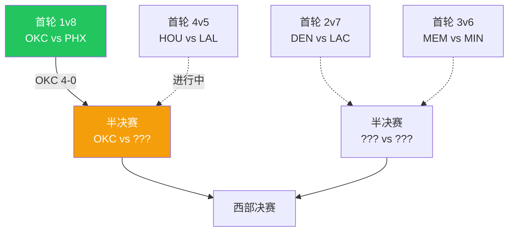
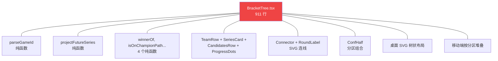
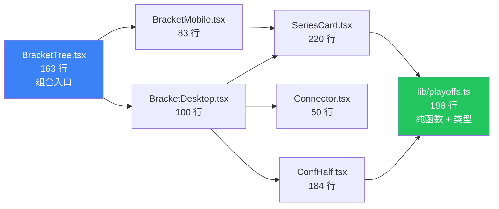
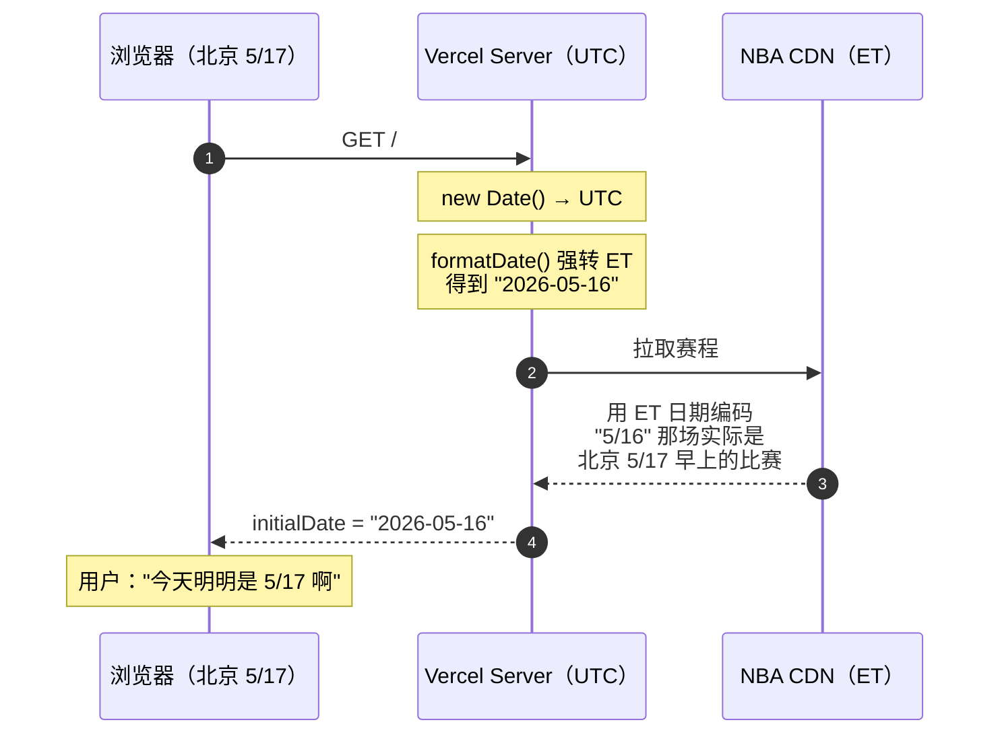
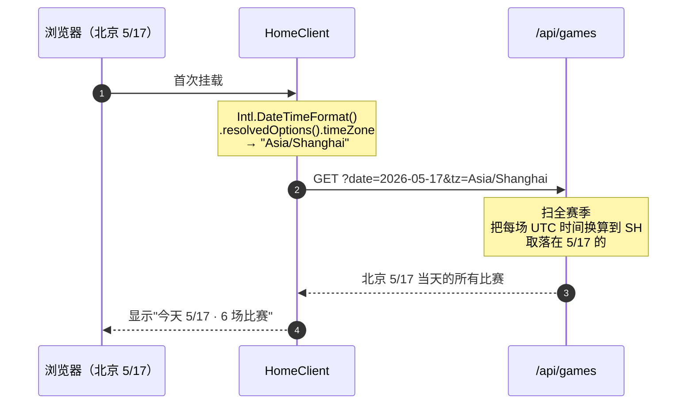
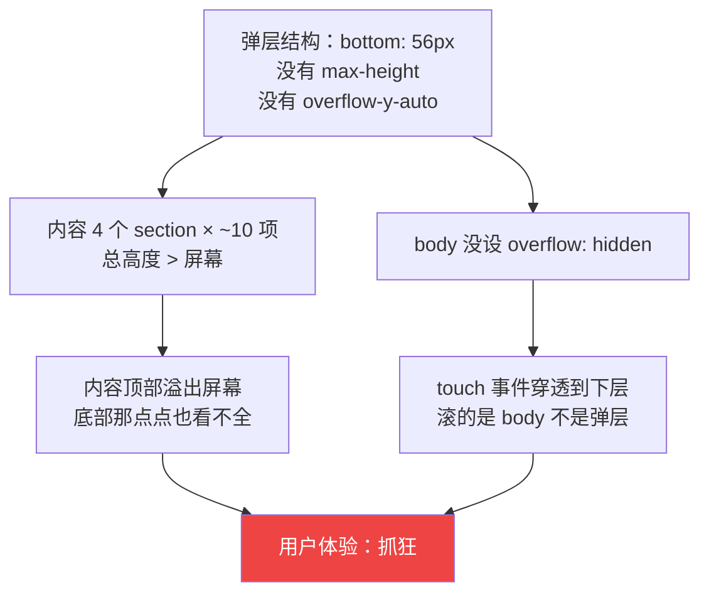
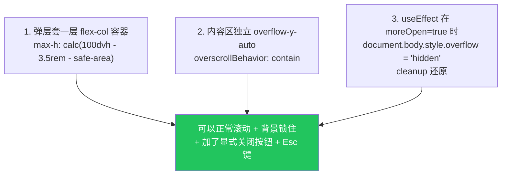
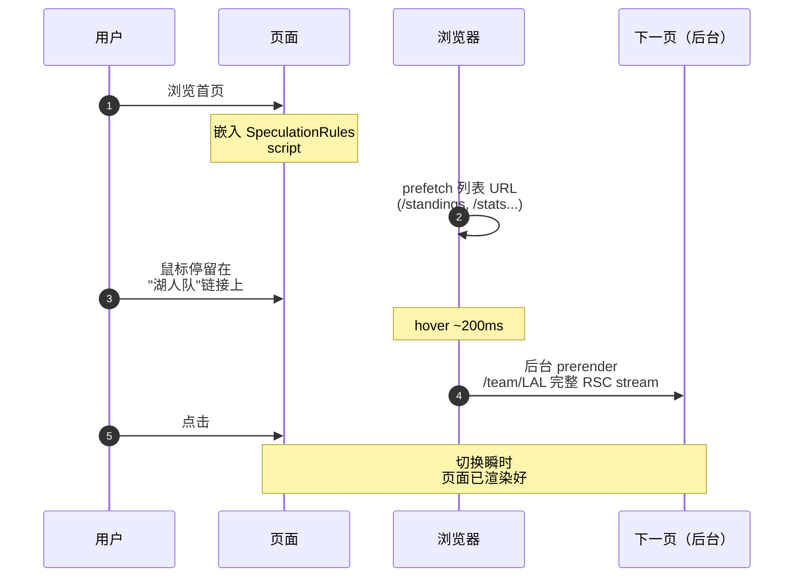
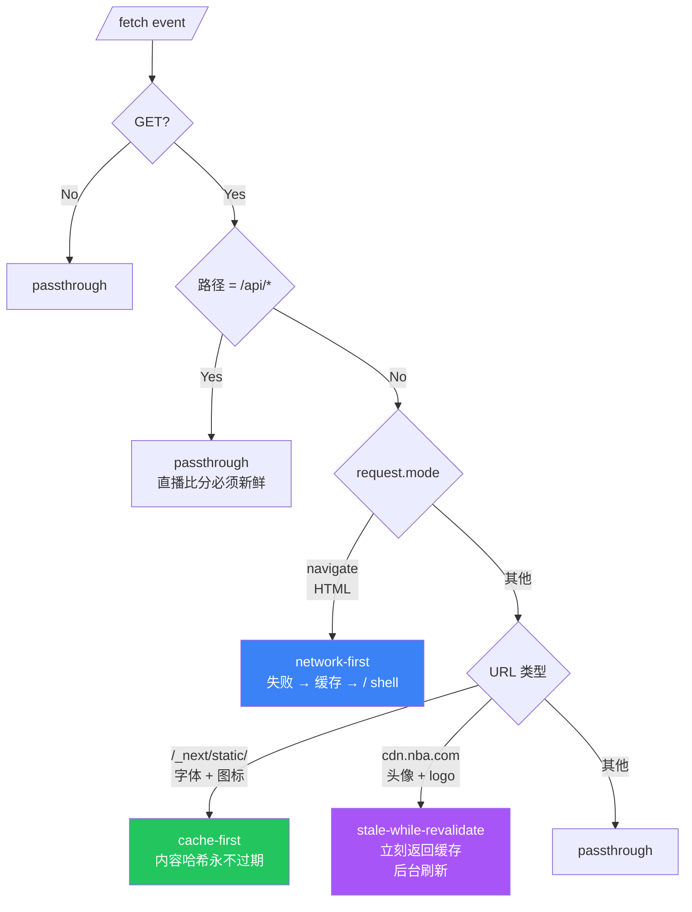
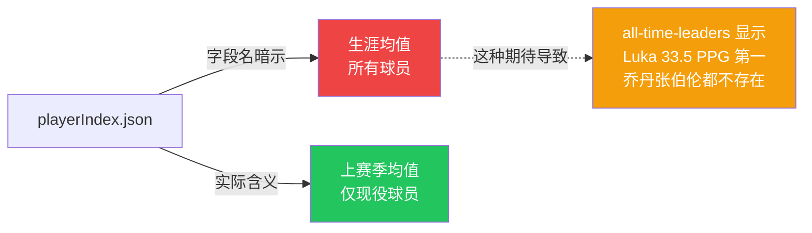

# NBA Tracker v2：从 8800 行到 30000 行，做了什么

**作者:** FXY
**日期:** 2026-05-17
**分类:** 技术分享
**标签:** Next.js 16、React 19、Tailwind 4、Service Worker、a11y、PWA

---

[上一篇](https://nba.xpy.me/article)写到第一版的 NBA Tracker：8800 行代码、16 个页面、纯 SVG 投篮图。那时候我以为已经"做完"了。

然后有一天我手机上点了一下底栏的"更多"按钮——

【图片：手机端更多菜单错位 — 文件 40-mobile-more-bug.png】

弹层撑出屏幕外，按住屏幕滚动，居然滚的是**下层页面**，弹层本身却滚不动。

烦了。一通修就完了？没想到这个小 bug 引出了一场全站审计，最后又写了 21000 行代码，把站点从"功能完整但有点糙"做成了"该有的都有的现代 Web App"。

这篇记录这次更新。先看现在的样子，再讲怎么做的，最后聊一些感想。

---

## Part 1：现在长什么样

### 首页：还是每天打开看比分的地方

【图片：首页 - 桌面端 - 文件 01-homepage-desktop.png】

最上面是日期导航，可以左右翻天看历史比赛。比分依然 30 秒自动刷新——你不用刷页面，正在打的比赛会自动更新。

新增了一些细节：

- **顶部 2 像素进度条**：跟着滚动位置走，纯 CSS 实现，零 JS 监听
- **"最近浏览"卡片**：你点开过的球员/球队/比赛会浮现在首页底部，方便回访
- **"X 分钟前更新"标签**：每个数据页都标着，告诉你看到的数据有多新

【图片：最近浏览组件 — 文件 20-recently-viewed.png】

【图片：滚动进度条 + 新鲜度标签 — 文件 25-scroll-progress-updated-pill.png】

### 季后赛对阵图：树状可视化

底部的对阵图重做了。SVG 连接线、卡片之间有进度点（这个系列打了几场），并且**部分已晋级球队的位置会预填**——比如雷霆 4-0 横扫太阳后，下一轮"OKC vs ???"会直接标出 OKC，等火箭-湖人系列结束后再填另一边。

【图片：对阵图全貌 — 文件 30-bracket-tree.png】



每个系列赛卡片可以点进去，跳到独立的系列赛详情页：

【图片：系列赛详情页 — 文件 31-series-detail.png】

里面有逐场战果、双方场均、最大胜差、关键球员排行——把整个 best-of-7 拍扁到一个页面看。

### 历史排行：终于是真的历史了

`/all-time-leaders` 之前有点搞笑——号称"NBA 历史排行榜"，但显示的第一名是 Luka Dončić 33.5 PPG。**乔丹和张伯伦都没出现**。

为啥？后面技术部分细说，简单讲就是数据源在骗我。现在修好了：

【图片：历史排行真实版 — 文件 21-all-time-leaders-real.png】

- **生涯场均得分**：乔丹 30.12 / 张伯伦 30.07 / Luka 28.7 / 拉里伯德 27.2 / LBJ 27.0
- **生涯总得分**：LeBron 42184 / 贾巴尔 38387 / 卡尔马龙 36928 / 科比 33643 / 乔丹 32292
- **生涯场均助攻**：魔术师 11.19 / 斯托克顿 10.51 / 大 O 9.51 / CP3 9.4
- **生涯总篮板**：张伯伦 23924 / 比尔拉塞尔 21620 / 贾巴尔 17440

45 位 GOAT，20 个现役 + 25 个退役传奇。终于像一份"历史榜"了。

### 词汇表：82 个篮球术语，全中文

`/glossary` 之前是英文的。现在 82 个词条全部翻译成虎扑式中文（"协防 / 护框者 / 退守战术 / 横扫 / 附加赛"），加了"阵容与战术"和"交易与名单"两个新分类。

【图片：中文词汇表 — 文件 22-glossary-zh.png】

可以搜索（中英文都能匹配），按分类浏览。新手球迷理解专业术语的入口。

### 知识竞赛：4 种模式 + Legend 模式

`/quiz` 加了第 4 个模式——"猜历史名人"。从那 45 位 GOAT 里随机出题，给生涯均值，让你 4 选 1。

【图片：Legend Quiz 模式 — 文件 28-legend-quiz.png】

知道乔丹的生涯场均 30.12 是一回事，看到一组 `30.07 / 22.9 / 4.4 / 退役` 能马上认出是张伯伦——又是另一回事。算是一个 NBA 历史小测验。

### PWA：能装到手机主屏

整站可以"安装到主屏"，装好之后就是一个独立 App：

【图片：安装提示 — 文件 26-install-prompt.png】

- 安卓 / Chrome / Edge：底部弹出"安装"卡片，点一下确认
- iPhone Safari：弹出"点击分享按钮 → 添加到主屏"的引导（iOS 不允许程序触发安装）

装完之后**断网也能用**。新加了 Service Worker（后面会讲），打开离线模式刷新页面：

【图片：离线模式 — 文件 27-offline-banner.png】

- 顶部弹红条："网络已断开 · 已显示缓存数据"
- 首页 shell 还在
- 静态资源（CSS / 字体 / 球队 logo）全部从缓存来
- 联网时无感恢复，红条变绿条 2.5 秒后消失

### 全站发现：底部"继续探索"

之前点进一个数据页（比如 `/streaks` 连胜连败），看完只能浏览器后退。

现在每个数据页底部都有"继续探索"区，5-6 个相关链接：

【图片：RelatedPages 卡片 — 文件 24-related-pages.png】

详情页顶部还多了 breadcrumbs：

【图片：Breadcrumbs + 新鲜度标签 — 文件 23-breadcrumbs.png】

整站 33 个分析页都标准化了这两个组件。从一个数据视图能跳到 5-6 个相关视图——**没有死胡同**。

### 搜索：230+ 别名

之前搜"字母哥"返回 0 结果。现在能搜：

- **中文外号**：字母哥、约老师、大胡子、阿杜、库里、利拉德、浓眉、卡哇伊、东契奇、威少、大帝、塔图姆、文班、蚂蚁、崔阳、胖虎...
- **英文外号**：King James、Greek Freak、Chef Curry、Dame、AD、The Beard、KD...
- **传奇球员**：乔丹、科比、张伯伦、魔术师、拉里伯德、奥尼尔、邓肯、艾弗森、奥拉朱旺...
- **球队名直接搜**：搜"湖人"或"Lakers"返回整队现役球员

【图片：搜索别名命中 — 文件 32-bilingual-search.png】

---

## Part 2：技术怎么实现的

下面挑几个有意思的实现细节聊聊。代码全部开源在 `github.com/fxy2026/nba-tracker`，可以对照看。

### 拆分巨型组件

第一版的对阵图 `BracketTree.tsx` 是个 911 行的怪物。



每次想动一个细节都要在这 911 行里翻很久。拆完之后：



拆分原则有三条：

1. **纯函数下沉到 `lib/`**：无 React、无 JSX、无副作用的代码全部抽到 `lib/`，纯 TS。这样可以独立测试，也方便 server component 直接调用。
2. **组件单一职责**：一个文件一个组件（或紧密耦合的小组件组）。
3. **视觉零变化**：重构期间 CSS 类名、prop 形状一个字符都不改，渲染结果 byte-identical。

`game/[id]/page.tsx`（比赛详情页）也用同样思路拆：1026 行 → 243 行 + 13 个 `_components/` 子组件 + `lib/game-stats.ts`。`team/[tricode]/page.tsx`：786 行 → 295 行 + 6 个子组件。

> Next.js 的 `_components/` 约定：在 App Router 里，下划线开头的文件夹**不会被识别为路由**。所以可以放在路由文件夹下作为同 colocate 的私有组件——只在比赛页用到的子组件就该和它一起住。

最大收益不是行数减少，是**单元的认知负担降低**——以后维护这个区域不需要把 900 行装进脑子。

### 时区：一个 bug 渗透到全栈

中国用户北京时间 5/17 早上 10 点打开网站，看到顶部写着"今天 5/16"。



直接原因：NBA 官方赛程用美东时间编码。北京时间凌晨开打的比赛，在赛程数据里写的是前一天。但服务端代码强转 ET 算"今天"，于是中国用户看到的"今天"是 ET 的今天（北京的昨天）。

修法：**把"用户的本地时区"当成 first-class concept 沿着请求链一路传**。

新加 `src/lib/timezone.ts`：

```typescript
export function localTz(): string {
  try {
    return Intl.DateTimeFormat().resolvedOptions().timeZone || "America/New_York";
  } catch {
    return "America/New_York";
  }
}

export function dateInTz(d: Date, tz: string = localTz()): string {
  return new Intl.DateTimeFormat("en-CA", {
    timeZone: tz,
    year: "numeric", month: "2-digit", day: "2-digit",
  }).format(d);
}
```

然后 `/api/games` 接受 `?tz=Asia/Shanghai`，扫全赛季日程，把每场比赛的 UTC 开球时间换算到用户时区，看它落在哪一天：

```typescript
for (const gd of schedule) {
  for (const g of gd.games) {
    if (!g.gameDateTimeUTC) continue;
    if (dateInTz(new Date(g.gameDateTimeUTC), tz) !== date) continue;
    matched.push(g);
  }
}
```

修完之后：



类似的修复扩散到 `DateNav.tsx`、`GamesList.tsx`、`/api/calendar`、`/app/calendar/page.tsx`。每一处都用 `Intl.DateTimeFormat` + 用户时区，不用 `new Date().toISOString()`（那个返回 UTC）也不用强转 ET 的 helper。

### 手机端"更多"菜单的修复

开头那个 bug。弹层撑出屏幕、滚不动、按住反而滚动下层——经典的"忘记给弹层做 max-height + body 没锁"组合拳。



修法三步：



代码片段：

```tsx
// Body scroll lock — iOS Safari 会高高兴兴地穿透弹层滚下层页面
useEffect(() => {
  if (!moreOpen) return;
  const prev = document.body.style.overflow;
  document.body.style.overflow = "hidden";
  return () => { document.body.style.overflow = prev; };
}, [moreOpen]);

// 弹层结构
<div className="fixed inset-0 z-40 flex flex-col" onClick={closeOverlay}>
  <div className="flex-1" />  {/* 上方空白区，点击关闭 */}
  <div
    className="bg-bg-card max-h-[calc(100dvh-3.5rem-env(safe-area-inset-bottom))] flex flex-col"
    onClick={(e) => e.stopPropagation()}
    style={{ overscrollBehavior: "contain", touchAction: "pan-y" }}
  >
    <Header />  {/* 把手 + 关闭按钮 */}
    <div className="overflow-y-auto px-4 pb-2 flex-1">
      {/* 4 个 section，现在可以正常滚 */}
    </div>
  </div>
</div>
```

几个细节：

- `100dvh` 而不是 `100vh`：动态视口高度，会考虑浏览器地址栏。`vh` 在移动端往往算多
- `env(safe-area-inset-bottom)`：iOS 刘海屏的底部安全区
- `overscrollBehavior: contain`：阻止"滚动链"（scroll chaining）——弹层滚到底再继续滑不会传到 body
- `touchAction: pan-y`：允许垂直拖动，禁止水平滑动（避免误触发浏览器后退手势）

> body 锁的 cleanup 一定要**还原原始值**，不要硬编码成 `"auto"`。否则套娃 modal（modal 里再开 modal）外层关闭时会把内层的锁也清掉。

### 现代 CSS：去 JS 化

这几年 CSS 加了一堆以前需要 JS 才能做的能力。这次实战了几个：

**`text-wrap: balance`**

```css
h1, h2, h3 { text-wrap: balance; }
p { text-wrap: pretty; }
```

`balance` 让浏览器在标题断行时计算最佳分布，避免"最后一行就一个字"。`pretty` 给段落用。**一行 CSS，全站质感拉满**。Chrome 114+ / Edge 114+ / Safari 17.4+ 已支持。

**`:has()` 选择器**

之前要做"父元素响应子元素状态"必须 JS，开个 state 监听 hover。现在：

```css
/* 卡片含 Link/Button 在 hover 时整张卡片提亮 */
.glass-tile:has(a:hover),
.glass-tile:has(button:hover) {
  border-color: var(--border-strong);
  box-shadow: var(--shadow-elevated);
}

/* 卡片内任意子元素 focus-visible 时显示焦点环 — 键盘用户友好 */
.glass-tile:has(:focus-visible) {
  outline: 2px solid var(--accent);
  outline-offset: 2px;
}
```

CSS 一行，键盘可访问性瞬间到位。

**滚动驱动动画**

页面顶部那条 2px 的进度条，跟着滚动位置走：

```css
.scroll-progress-rail::after {
  content: "";
  display: block;
  height: 100%;
  background: var(--gradient-accent);
  transform-origin: 0 50%;
  animation: scroll-progress-grow linear;
  animation-timeline: scroll(root);  /* ← 关键：跟着根滚动条走 */
}
@keyframes scroll-progress-grow {
  from { transform: scaleX(0); }
  to { transform: scaleX(1); }
}
```

**零 JS、零 scroll listener、零 jank**。Chrome 115+ 原生支持，老浏览器静默忽略——进度条不显示，但不报错。

之前类似效果需要：

```javascript
window.addEventListener("scroll", () => {
  const progress = window.scrollY / (document.body.scrollHeight - window.innerHeight);
  bar.style.transform = `scaleX(${progress})`;
}, { passive: true });
```

每次滚动事件都触发布局抖动。**别再写这种代码了**。

### Speculation Rules：预测性导航

Chrome 122+ 加的新 API，能告诉浏览器：哪些 URL 值得预先 prefetch 或者 prerender。



代码：

```tsx
const rules = {
  prefetch: [
    { source: "list", urls: ["/", "/standings", "/stats", "/search", "/calendar"] },
  ],
  prerender: [
    {
      source: "document",
      where: {
        and: [
          { href_matches: "/*" },
          { not: { href_matches: "/admin*" } },
          { not: { href_matches: "/api/*" } },
        ],
      },
      eagerness: "moderate",  // hover 时 prerender
    },
  ],
};

return <script type="speculationrules" dangerouslySetInnerHTML={{ __html: JSON.stringify(rules) }} />;
```

两个层级：

1. **prefetch**：固定的 5 个高频入口一次性 prefetch
2. **prerender + `eagerness: "moderate"`**：鼠标 hover 200ms 后浏览器在后台 prerender 任意站内非 /admin 非 /api 链接

体感非常明显。比手写 `Link.prefetch` 强一档。

### Service Worker：分桶缓存

之前的 PWA 只有 manifest.json。能装到主屏，但断网就废了。这次加了 `public/sw.js`，按请求类型分桶缓存：



代码：

```javascript
self.addEventListener("fetch", (event) => {
  const req = event.request;
  if (req.method !== "GET") return;

  const url = new URL(req.url);
  if (url.pathname.startsWith("/api/")) return;  // 实时数据不拦截

  if (req.mode === "navigate") {
    event.respondWith(
      fetch(req)
        .then((res) => {
          if (res.ok) caches.open(CACHE_PAGES).then((c) => c.put(req, res.clone()));
          return res;
        })
        .catch(() => caches.match(req).then((c) => c || caches.match("/")))
    );
    return;
  }

  // _next/static 走 cache-first，cdn.nba.com 走 SWR...
});
```

设计要点：

1. **`/api/*` 永远 passthrough**：直播比分不能缓存
2. **HTML network-first + 离线 shell fallback**：在线时永远拿新数据；断网时拿缓存或 `/` 首页
3. **`_next/static/` cache-first**：Next 构建的资源 URL 带内容哈希，可以无限期缓存
4. **图片 stale-while-revalidate**：先显示缓存，后台刷新
5. **版本化缓存**：`CACHE_VERSION = "v1"`，每次 breaking change bump。activate 时清掉旧版本，避免新部署后老 chunk 僵尸服务

iOS Safari 特殊处理：那个浏览器**永远不会触发** `beforeinstallprompt`。所以 InstallPrompt 组件做 UA 检测，遇到 iOS 不显示 Install 按钮，改为弹引导："点击 Safari 分享按钮 → 添加到主屏幕"。

### 数据准确性：playerIndex 在骗你

NBA CDN 的 `playerIndex.json` 有 `pts/reb/ast` 三个字段。字段名让你以为是"得分"。

**实际含义是：该球员上一个完整赛季的场均**（如果今年没打就是 0）。

而且——**playerIndex 只包含现役球员**。乔丹 2003 年退役不在里面，张伯伦 1973 年退役更不在。



`stats.nba.com` 的历史职业端点被 CORS 卡死，Vercel IP 也被拒。走 API 路径不通。

最后的修法：**手工录入静态历史榜单**。45 个球员，覆盖 20 个现役 + 25 个退役传奇，生涯均值用 NBA 官方记录：

```typescript
// src/lib/allTimeLeaders.ts
export const ALL_TIME_LEADERS: AllTimeLeader[] = [
  { personId: 0, name: "Michael Jordan", fromYear: 1984, toYear: 2003, active: false, team: "CHI",
    ppg: 30.12, rpg: 6.2, apg: 5.3, spg: 2.3, bpg: 0.8,
    totalPts: 32292, totalReb: 6672, totalAst: 5633, totalStl: 2514 },
  { personId: 0, name: "Wilt Chamberlain", fromYear: 1959, toYear: 1973, active: false, team: "LAL",
    ppg: 30.07, rpg: 22.9, apg: 4.4,
    totalPts: 31419, totalReb: 23924, totalAst: 4643 },
  // ... 共 45 条
];
```

类似的"标签 vs 数据"不一致还在 5 个页面里发现：

| 页面 | 错误标签 | 实际数据 | 修法 |
|------|---------|---------|------|
| `/rookie-watch` | "本赛季新秀" | 上赛季新秀（playerIndex 数据滞后） | 按 draftYear 过滤 + 显式说明 |
| `/milestones` | "Career Milestones" | 用上赛季均推算的生涯总和 | 改名"生涯轨迹追踪"，明确是投影 |
| `/awards-race` ROY | "Rookie of the Year" | 所有联赛球员（老兵霸榜） | 加 rookie 过滤器 |
| `/by-position/country/college` | 球员场均 | 上赛季均值 | 标签后加"· 上赛季"限定 |

**Bug 让用户感知到问题（页面挂了）。标签错了让用户带着错误信息走**。后者更难发现，影响更大。

---

## Part 3：现在的状态

代码层面：

```
30,000+   行 TypeScript/TSX（之前 8,800）
71        React 组件（之前 39）
46        路由（之前 16）
16        API endpoints
20        lib 模块
82        词汇表条目（中英双语）
230+      球员搜索别名
~5s       生产构建（Turbopack）
0         lint 错误，0 类型错误
```

体验层面：

- 装到主屏 → 断网能看 → 联网无感更新
- 中英双语全覆盖，搜索支持中英文别名 + 球队名
- A11y 焦点陷阱 / aria-label / 屏幕阅读器友好
- 44px 触控目标 + iOS 安全区 + 反穿透
- 33 个数据页底部都有"继续探索"，没死胡同
- 滚动条 / "X 分钟前"标签 / 最近浏览 / Toast 反馈

---

## 几个真实的工程教训

1. **field 的名字 ≠ field 的含义**。永远验证一遍数据源 schema。
2. **小 bug 是冰山**。手机端"更多"菜单滚不动这种小问题，往往挂着 body scroll lock 缺失、max-height 没设、overscrollBehavior 没配置一整套问题。
3. **本地时区是 first-class concept**。函数签名上写出来，不要让"哪个 timezone"隐含。
4. **拆分的最大收益不是行数减少**。是单元的认知负担降低——以后维护这个区域不需要把 900 行装进脑子。
5. **CSS 已经能做你以为只能 JS 做的事**。`:has()`、容器查询、滚动驱动动画、`text-wrap: balance` 都是这两年的新能力。**别再写 scroll listener 算进度条了**。
6. **Service Worker 不可怕**。坚持几个原则：`/api/*` 不拦截 / HTML network-first / hashed static 永久缓存 / 版本化 purge。
7. **PWA 是免费的护城河**。一份代码同时是网站 + iOS app + Android app + 桌面 PWA。
8. **标签错比 bug 还可怕**。Bug 是用户能感知到问题。标签错是用户带着错误信息走。

---

## 现在试试

线上地址：**[nba.xpy.me](https://nba.xpy.me)**

代码（完全开源）：**[github.com/fxy2026/nba-tracker](https://github.com/fxy2026/nba-tracker)**

试试这些：

- `/all-time-leaders` 切换"生涯总得分" → 应该看到 LeBron 42184 / 贾巴尔 38387 / 卡尔马龙 36928
- `/glossary` 切中文 → 82 个篮球术语全中文
- /search 输入"字母哥"或"司机" → 立即命中
- 任意比赛/球员/球队详情页底部 → "继续探索"卡片
- 手机访问 → 顶部"安装到主屏"按钮 → 加到主屏
- 装好后断网刷新 → 仍能看到首页 shell + 顶部红条提示离线

代码 fork 之后可以一键部署到自己的 Vercel，env vars 留空也能用（NBA CDN 数据完全免费）。

季后赛还在打。欢迎用起来，欢迎 Star。

---

*本文采用 CC BY-NC-SA 4.0 许可协议，转载请注明出处。*
