# 手搓一个 NBA Tracker：8800 行代码的全栈练手记录

**作者:** FXY
**日期:** 2026-4-29
**分类:** 技术分享
**标签:** 前端、Next.js、React、SVG、性能优化

---

坐标上海，交大大一。

季后赛打得正热闹，我每天至少查三次比分。ESPN 广告满天飞，腾讯体育加载半天，NBA 官网的 Box Score 藏在三级页面里。

烦了，自己写一个。

从第一行代码到现在大概迭代了一个多月，趁着季后赛正酣，把技术实现完整过一遍。不是教程，是踩坑实录。

---

## 先看成品

首页打开就是当日比赛，比分 30 秒自动刷新。下方自动生成季后赛对阵图。

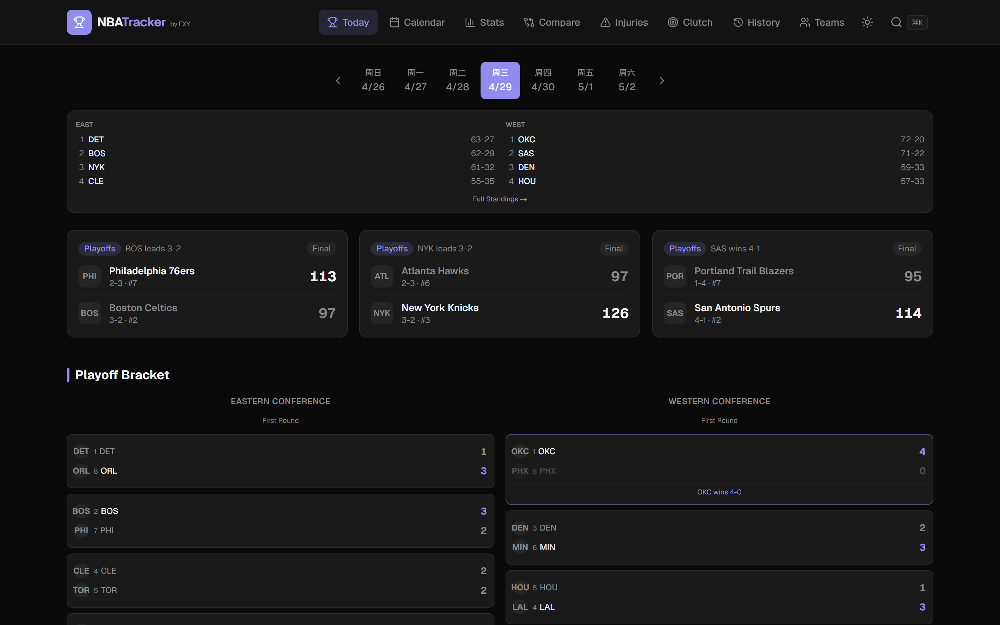

往下滑，季后赛对阵 + 近期战果一目了然：

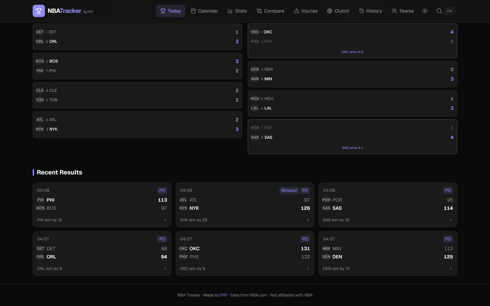

手机上也能用。底部 Tab 导航，添加到主屏幕后就是一个独立 App：

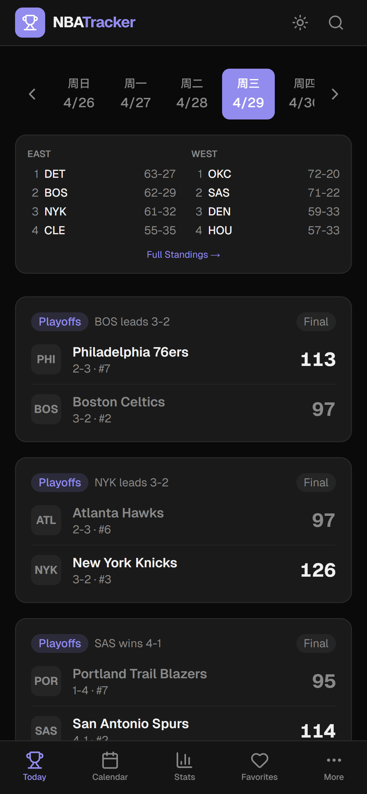

---

## 0x01 数据从哪来

很多人不知道，`cdn.nba.com/static/json/` 下面藏着大量**完全免费、无需 API Key** 的 JSON 接口。

```typescript
// 今日记分牌 — 比赛期间每分钟更新
"https://cdn.nba.com/static/json/liveData/scoreboard/todaysScoreboard_00.json"

// 任意一场比赛的 Box Score
`https://cdn.nba.com/static/json/liveData/boxscore/boxscore_${gameId}.json`

// 逐球回放数据（投篮坐标、时间轴、描述）
`https://cdn.nba.com/static/json/liveData/playbyplay/playbyplay_${gameId}.json`

// 完整赛程 — 一整个赛季，11MB
"https://cdn.nba.com/static/json/staticData/scheduleLeagueV2.json"
```

但这些接口有两个技术难点：一是 11MB 的赛程 JSON 不能每次请求都拉；二是 CDN 有 Referer 校验，裸 fetch 会被拒绝。

第二个好解决，带个 `Referer: https://www.nba.com/` 就行：

```typescript
const HEADERS: HeadersInit = {
  "User-Agent": "Mozilla/5.0 (Windows NT 10.0; Win64; x64)",
  Referer: "https://www.nba.com/",
};
```

第一个需要认真设计。

---

## 0x02 11MB 赛程的缓存架构

Next.js 的 data cache 上限 2MB，赛程 JSON 塞不进去。频繁请求 11MB 的文件不仅慢，而且 CDN 迟早限流。

解决方案：**内存级缓存 + stale-while-revalidate + 互斥锁**。

先看整体决策流程：

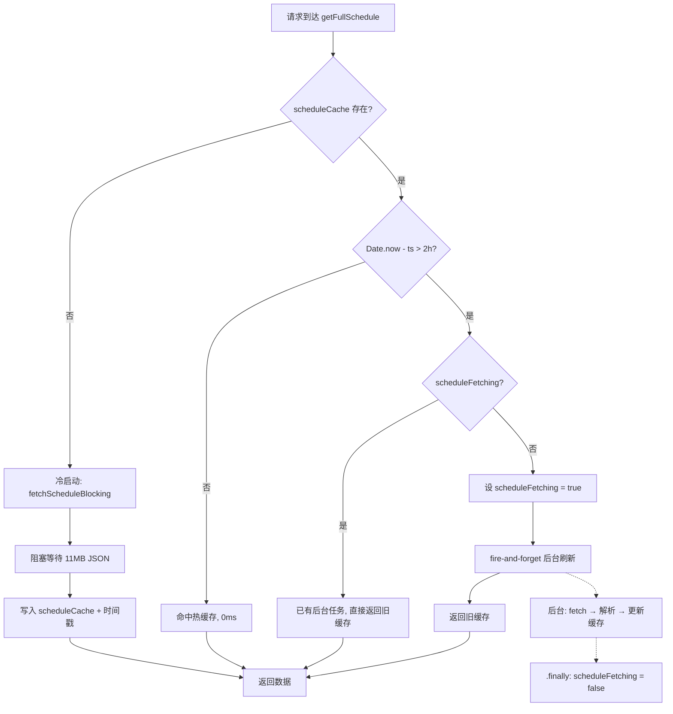
```mermaid
flowchart TD
    A[请求到达 getFullSchedule] --> B{scheduleCache 存在?}
    B -- 否 --> C[冷启动: fetchScheduleBlocking]
    C --> D[阻塞等待 11MB JSON]
    D --> E[写入 scheduleCache + 时间戳]
    E --> F[返回数据]
    B -- 是 --> G{Date.now - ts > 2h?}
    G -- 否 --> H[命中热缓存, 0ms]
    H --> F
    G -- 是 --> I{scheduleFetching?}
    I -- 是 --> J[已有后台任务, 直接返回旧缓存]
    J --> F
    I -- 否 --> K[设 scheduleFetching = true]
    K --> L[fire-and-forget 后台刷新]
    L --> M[返回旧缓存]
    M --> F
    L -.-> N[后台: fetch → 解析 → 更新缓存]
    N -.-> O[.finally: scheduleFetching = false]
```

对应的代码：

```typescript
let scheduleCache: { data: ScheduleDate[]; ts: number } | null = null;
const SCHEDULE_TTL = 2 * 60 * 60 * 1000; // 2 小时
let scheduleFetching = false; // 互斥锁

export async function getFullSchedule(): Promise<ScheduleDate[]> {
  if (scheduleCache) {
    if (Date.now() - scheduleCache.ts > SCHEDULE_TTL && !scheduleFetching) {
      scheduleFetching = true;
      fetchScheduleInBackground(); // fire-and-forget
    }
    return scheduleCache.data; // 即使过期也先返回
  }
  return fetchScheduleBlocking(); // 冷启动才阻塞
}
```

三层防护：

1. **热缓存** — 直接返回内存数据，0ms 延迟
2. **过期缓存** — 返回旧数据的同时，后台静默拉取新数据
3. **冷启动** — 只在服务器刚启动、内存为空时阻塞等待

`scheduleFetching` 是一个简单的互斥锁。为什么不用 `Promise` 或 `Mutex` 类？因为这里的并发模型是 Node.js 单线程事件循环——不存在真正的竞态条件，一个布尔标志足够防止重复请求。后台刷新完成后在 `.finally()` 里释放：

```typescript
function fetchScheduleInBackground() {
  fetch(SCHEDULE_URL, { headers: HEADERS, next: { revalidate: 7200 } })
    .then(res => res.ok ? res.json() : null)
    .then(data => {
      if (data) {
        scheduleCache = { data: dates, ts: Date.now() };
      }
    })
    .catch(() => {})  // 静默失败，下次请求会重试
    .finally(() => { scheduleFetching = false; });
}
```

注意 `.catch(() => {})` 不是偷懒——后台刷新失败不应该影响任何用户请求。旧缓存仍然可用，下一个过期的请求会自动触发重试。

球员索引也用了同样的模式。`playerIndex.json` 大约 2MB，但它的 TTL 是永久——球员不会在一天之内换队，缓存一旦建立，直到服务器重启才失效。

---

## 0x03 首页请求生命周期

首页是一个 React 19 Server Component。比分数据在服务端获取，HTML 直出到客户端——**零客户端 JS 请求比分数据**。

整个请求链路：

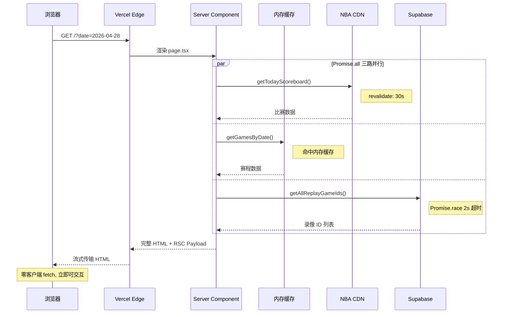
```mermaid
sequenceDiagram
    participant B as 浏览器
    participant V as Vercel Edge
    participant SC as Server Component
    participant Cache as 内存缓存
    participant NBA as NBA CDN
    participant Supa as Supabase

    B->>V: GET /?date=2026-04-28
    V->>SC: 渲染 page.tsx
    
    par Promise.all 三路并行
        SC->>NBA: getTodayScoreboard()
        Note right of NBA: revalidate: 30s
        NBA-->>SC: 比赛数据
    and
        SC->>Cache: getGamesByDate()
        Note right of Cache: 命中内存缓存
        Cache-->>SC: 赛程数据
    and
        SC->>Supa: getAllReplayGameIds()
        Note right of Supa: Promise.race 2s 超时
        Supa-->>SC: 录像 ID 列表
    end
    
    SC-->>V: 完整 HTML + RSC Payload
    V-->>B: 流式传输 HTML
    Note over B: 零客户端 fetch, 立即可交互
```

核心代码里有三个设计决策值得展开：

```typescript
const [liveGames, scheduledGames, replayGameIds] = await Promise.all([
  isToday ? getTodayScoreboard() : Promise.resolve([]),
  !isToday ? getGamesByDate(selectedDate) : Promise.resolve([]),
  Promise.race([
    getAllReplayGameIds().catch(() => [] as string[]),
    new Promise<string[]>(r => setTimeout(() => r([]), 2000)),
  ]),
]);
```

**条件分流**。`isToday` 决定走实时记分牌 API（30 秒 revalidate）还是赛程缓存（命中内存，0ms）。两个分支互斥，`Promise.all` 里永远只有一个在做真实 I/O，另一个是 `Promise.resolve([])`，零开销。

**非关键路径超时**。录像链接存在 Supabase 免费 tier 里。免费 tier 的冷启动时间有时超过 5 秒——如果首页等它加载完，整个页面就卡住了。`Promise.race` 加 2 秒超时：Supabase 在 2 秒内响应就用它的数据，超时就返回空数组。比分照常显示，录像链接只是锦上添花。

**错误边界**。注意 `.catch(() => [] as string[])` 在 `Promise.race` 的内部，不是外部。这意味着即使 Supabase 抛异常，`Promise.race` 也会正常 resolve 为空数组，不会让整个 `Promise.all` 失败。

结果：首页**只有 2 个客户端请求**（迷你排名条 + 季后赛附加信息），其余全部服务端渲染。从 7 个客户端 fetch 优化到 2 个。

---

## 0x04 比赛详情页：Suspense 流式架构

点进一场比赛，页面有五个数据区块：比分板、Box Score、投篮图、关键时刻、逐球回放。它们的数据源不同，加载时间也不同。

传统做法是等所有数据都拉完再渲染整个页面。Suspense 允许我们分段流式传输——先到先渲染：

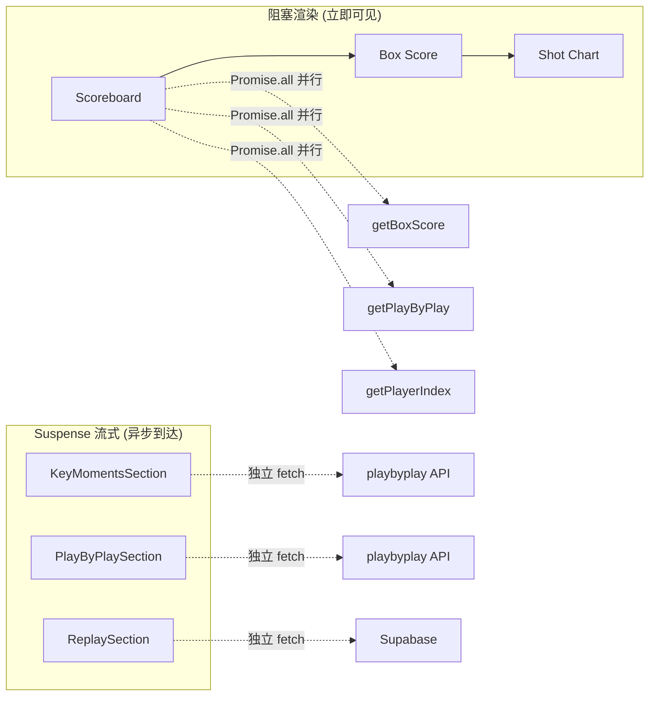
```mermaid
flowchart LR
    subgraph "阻塞渲染 (立即可见)"
        A[Scoreboard] --> B[Box Score]
        B --> C[Shot Chart]
    end

    subgraph "Suspense 流式 (异步到达)"
        D[KeyMomentsSection]
        E[PlayByPlaySection]
        F[ReplaySection]
    end

    A -.->|Promise.all 并行| G[getBoxScore]
    A -.->|Promise.all 并行| H[getPlayByPlay]
    A -.->|Promise.all 并行| I[getPlayerIndex]
    
    D -.->|独立 fetch| J[playbyplay API]
    E -.->|独立 fetch| K[playbyplay API]
    F -.->|独立 fetch| L[Supabase]
```

Server Component 里的代码结构：

```typescript
// 第一层：关键数据并行获取，阻塞渲染
const [boxScore, shots, playerIndex] = await Promise.all([
  getBoxScore(id),
  getPlayByPlay(id).catch(() => []),
  getPlayerIndex().catch(() => []),
]);

// 第二层：非关键区块用 Suspense 包裹，异步流入
<Suspense fallback={<SectionSkeleton />}>
  <KeyMomentsSection gameId={id} />    {/* async Server Component */}
</Suspense>

<Suspense fallback={<SectionSkeleton />}>
  <PlayByPlaySection gameId={id} />    {/* async Server Component */}
</Suspense>

<Suspense fallback={null}>
  <ReplaySection gameId={id} />        {/* Supabase, 可能很慢 */}
</Suspense>
```

`KeyMomentsSection` 和 `PlayByPlaySection` 是 **async Server Component**——它们自己内部做 `fetch`，React 会在数据到达时把渲染结果流式推送到浏览器，替换掉骨架屏。

注意 `ReplaySection` 的 fallback 是 `null` 而不是骨架屏。因为录像链接可能根本不存在——如果用骨架屏，用户会看到一个加载动画然后消失，体验很奇怪。

用户的感知：打开页面，比分板和 Box Score 瞬间出现（这是他们最关心的），关键时刻和逐球回放在 0.5-1 秒后流入。没有全页 loading，没有布局抖动。

---

## 0x05 双层轮询：30s / 15s 的频率设计

比赛进行时需要实时刷新，但不同页面的刷新频率应该不一样。

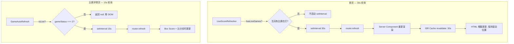
```mermaid
flowchart TB
    subgraph "首页 — 30s 轮询"
        A[LiveScoreRefresher] -->|hasLiveGames?| B{当天有比赛在打?}
        B -- 否 --> C[不启动 setInterval]
        B -- 是 --> D[setInterval 30s]
        D --> E[router.refresh]
        E --> F[Server Component 重新渲染]
        F --> G[ISR Cache revalidate: 30s]
        G --> H[HTML 增量更新, 保持滚动位置]
    end
    
    subgraph "比赛详情页 — 15s 轮询"
        I[GameAutoRefresh] -->|isLive?| J{gameStatus === 2?}
        J -- 否 --> K[返回 null, 零 DOM]
        J -- 是 --> L[setInterval 15s]
        L --> M[router.refresh]
        M --> N[Box Score + 比分实时更新]
    end
```

首页 30 秒足矣——用户在首页主要是浏览，不会盯着某一场的比分看。比赛详情页 15 秒，因为用户盯着 Box Score 时对延迟更敏感。

两个刷新组件都极其精简：

```typescript
// GameAutoRefresh.tsx — 23 行，比赛详情页 15 秒轮询
"use client";
export default function GameAutoRefresh({ isLive }: { isLive: boolean }) {
  const router = useRouter();
  useEffect(() => {
    if (!isLive) return;
    const id = setInterval(() => router.refresh(), 15_000);
    return () => clearInterval(id);
  }, [isLive, router]);
  return null; // 不渲染任何 DOM
}
```

关键设计：

**`router.refresh()` 不是 `location.reload()`**。它只重新执行 Server Component 的数据获取逻辑，把新的 RSC payload 流式推送到客户端，React 做 reconciliation 更新 DOM。用户看到的是无缝刷新——零白屏，滚动位置保持不变，input 焦点不丢失。

**条件启动**。`hasLiveGames` / `isLive` 由服务端计算。如果当天没有正在进行的比赛（或这场已经结束），轮询根本不启动。不浪费一丁点资源。组件返回 `null`，连 DOM 节点都没有。

**为什么不用 WebSocket？** NBA CDN 是静态 JSON 文件，没有 WebSocket 端点。而且对于比分刷新来说，15-30 秒的延迟完全可以接受——这不是股票交易。轮询的实现成本是 23 行代码，WebSocket 的连接管理、重连逻辑、心跳检测加起来至少 200 行。

---

## 0x06 SVG 手绘篮球场：210 行画一块标准场地

这是整个项目里我最得意的部分。

**纯 SVG，零依赖，210 行代码画出完整的 NBA 标准篮球场。** 三分线用二次贝塞尔曲线，禁区、罚球圈、篮框、限制区全是手算坐标。

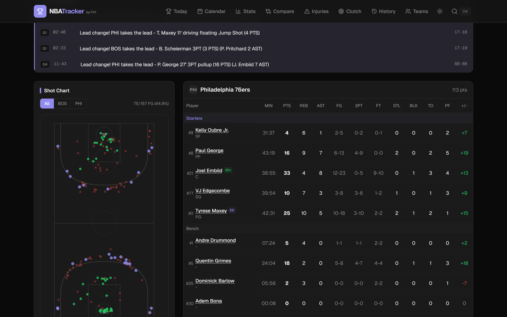

绿色实心圆 = 2 分命中，紫色圆 = 3 分命中，红色 X = 未命中。支持按队伍和球员筛选。

### 坐标系变换

NBA API 返回的投篮坐标是百分比值（0-100），x 表示球场纵向（94 英尺），y 表示横向（50 英尺）。但 SVG 的坐标系里 x 是横向、y 是纵向。

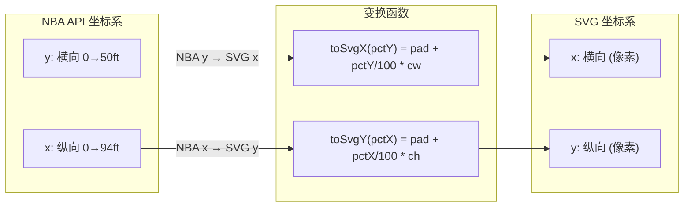
```mermaid
flowchart LR
    subgraph "NBA API 坐标系"
        direction TB
        NX["x: 纵向 0→94ft"]
        NY["y: 横向 0→50ft"]
    end
    
    subgraph "变换函数"
        T1["toSvgX(pctY) = pad + pctY/100 * cw"]
        T2["toSvgY(pctX) = pad + pctX/100 * ch"]
    end
    
    subgraph "SVG 坐标系"
        SX["x: 横向 (像素)"]
        SY["y: 纵向 (像素)"]
    end
    
    NY -->|"NBA y → SVG x"| T1 --> SX
    NX -->|"NBA x → SVG y"| T2 --> SY
```

**两个轴是反的。** 这两行是整个投篮图的灵魂：

```typescript
const toSvgX = (pctY: number) => pad + (pctY / 100) * cw;  // NBA y → SVG x
const toSvgY = (pctX: number) => pad + (pctX / 100) * ch;  // NBA x → SVG y
```

搞混了，所有的点都会画到错误的位置——我花了一个下午用已知投篮位置（罚球线、底角三分）做校准才最终对准。

### 场地几何常量

标准 NBA 球场的每一个数字都有规格文档，我把它们全部换算成 API 百分比坐标：

```typescript
const basketPctX = 5.59;        // 篮框中心距底线 5.25ft / 94ft * 100
const ftLinePctX = 19.15;       // 罚球线 = 底线起 19ft
const paintWidthPct = 32;       // 禁区宽 16ft / 50ft * 100
const corner3PctY = 6.3;        // 底角三分距边线 3.15ft
const corner3ExtPctX = 14.89;   // 底角三分延伸 14ft
```

三分线是最复杂的部分。底角段是直线（距边线 3 英尺 3 英寸），弧线段是以篮框为圆心、23 英尺 9 英寸为半径的弧。我用二次贝塞尔曲线 `Q` 近似：

```typescript
const arcPeakY = toSvgY(basketPctX + 25.26); // 弧顶：篮框 + 23.75ft/94*100

// 从左底角 → 弧顶 → 右底角
<path d={`
  M ${corner3X1} ${pad}
  L ${corner3X1} ${corner3Y}
  Q ${corner3X1} ${arcPeakY} ${svgCx} ${arcPeakY}
  Q ${corner3X2} ${arcPeakY} ${corner3X2} ${corner3Y}
  L ${corner3X2} ${pad}
`} />
```

两段 `Q`（二次贝塞尔）拼成完整弧线。控制点在弧顶水平线上，曲率由底角端点和控制点的相对位置自然决定。用一个 `A`（椭圆弧）也行，但贝塞尔的控制点更直观。

### 为什么选 SVG 而不是 Canvas

SVG 的每个投篮点都是独立的 DOM 节点。hover、click、按球员 filter **天然支持**，不需要自己实现命中检测。Canvas 画起来快，但交互要从零开始写 `isPointInPath`。对于一场比赛最多 200 个投篮点的规模，SVG 的 DOM 开销完全可以接受。

---

## 0x07 关键时刻识别：逐球数据上的状态机

点进一场比赛，系统会从 play-by-play 数据中自动提取关键时刻——领先交替、连续得分、绝杀球。

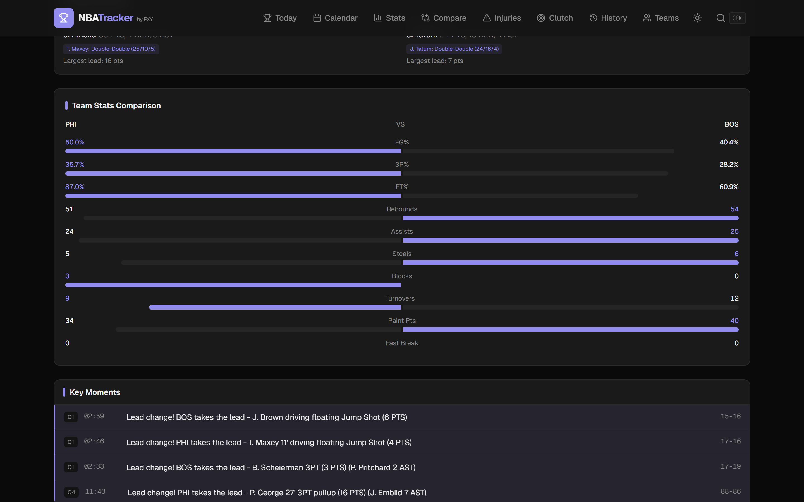

整个算法是一个**单次遍历的状态机**，维护三个状态变量，对每个得分 action 做四种检测：

```mermaid
flowchart TD
    START[遍历 play-by-play actions] --> A{有得分变化?}
    A -- 否 --> SKIP[跳过] --> START
    A -- 是 --> B[计算 diff = scoreAway - scoreHome]
    
    B --> C{prevDiff ≠ 0 且 diff ≠ 0\n且 sign 翻转?}
    C -- 是 --> D["🔄 lead_change\n领先交替"]
    C -- 否 --> E{得分队 === runTeam?}
    
    E -- 是 --> F[runPoints += delta\n连续得分累加]
    E -- 否 --> G{runPoints >= 8?}
    G -- 是 --> H["🔥 run\nX-0 scoring run"]
    G -- 否 --> I[重置 runTeam/runPoints]
    H --> I
    
    B --> J{period >= 4 且\nminutesLeft < 2 且\n|diff| <= 5 且 Made?}
    J -- 是 --> K["⚡ clutch\n关键球"]
    
    D & F & I & K --> L[更新 prevDiff]
    L --> START
    
    START -->|遍历结束| M[去重 + clockToSeconds 排序 + Top 15]
```

三个状态变量：

```typescript
let prevDiff = 0;      // 上一次的分差（正数 = 客队领先）
let runTeam = "";       // 当前连续得分的队伍
let runPoints = 0;      // 当前连续得分的分数
```

**领先交替** — 分差穿越零点时触发。`diff !== 0` 的判断很关键——比分追平但没有反超，不算领先交替：

```typescript
if (prevDiff !== 0 && diff !== 0 && Math.sign(diff) !== Math.sign(prevDiff)) {
  keyMoments.push({ type: "lead_change", ... });
}
```

**连续得分** — 8 分以上未被回应。当得分队伍切换时，检查上一轮是否达到阈值。8 分是经验值——太低会刷屏，太高会漏掉重要攻击波：

```typescript
if (action.teamTricode === runTeam) {
  runPoints += scoreDelta;
} else {
  if (runPoints >= 8 && runTeam) {
    keyMoments.push({ type: "run", description: `${runTeam} goes on a ${runPoints}-0 run` });
  }
  runTeam = action.teamTricode; runPoints = 0;
}
```

**绝杀球** — 四个条件缺一不可：Q4 或加时赛 (`period >= 4`)、最后 2 分钟 (`minutesLeft < 2`)、胶着比分 (`|diff| <= 5`)、命中 (`shotResult === "Made"`)。

### 时间解析的坑

NBA 的时钟格式是 ISO 8601 duration：`PT05M30.00S`。clock 值是「本节剩余时间」而不是「比赛已过时间」，必须反推：

```typescript
function clockToSeconds(clock: string, period: number): number {
  const ptMatch = clock.match(/PT(\d+)M([\d.]+)S/);
  const minutes = parseInt(ptMatch[1]);
  const seconds = parseFloat(ptMatch[2]);
  
  const periodLength = period <= 4 ? 720 : 300;  // 常规12分钟, OT 5分钟
  const elapsedInPeriod = periodLength - (minutes * 60 + seconds);
  const previousPeriods = period <= 4
    ? (period - 1) * 720
    : 4 * 720 + (period - 5) * 300;  // Q1-Q4共48分钟 + OT每节5分钟
  
  return previousPeriods + elapsedInPeriod;
}
```

previous periods 的累加分两段：Q1-Q4 每节 720 秒，OT 每节 300 秒。一个加时赛第 3 分钟的 action，它的绝对时间是 `4×720 + 0×300 + (300-180) = 3000` 秒。

---

## 0x08 比分走势：累计分差可视化

比赛详情页还有一个「Score Flow」组件——双向柱状图展示逐节累计分差。

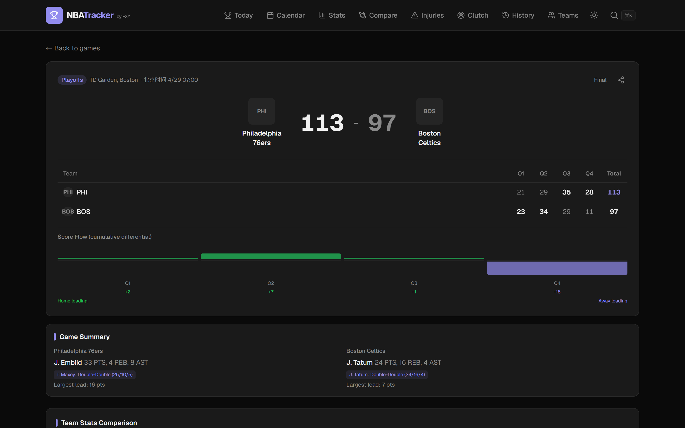

```typescript
let homeCum = 0, awayCum = 0;
const diffs = [];

for (const p of periods) {
  homeCum += p.homeScore;
  awayCum += p.awayScore;
  diffs.push({ label: `Q${p.period}`, diff: homeCum - awayCum });
}

const maxAbs = Math.max(...diffs.map(d => Math.abs(d.diff)), 1);
```

正值 = 主队领先（绿色向上），负值 = 客队领先（紫色向下）。每根柱子的高度是 `|diff| / maxAbs * 100%`，最大分差的柱子永远撑满容器高度。

`Math.max(..., 1)` 里的 `1` 是为了避免全场比分持平时除以零。一个小细节，但没有它就是一个 `NaN` 瀑布。

---

## 0x09 CSS 渲染性能

当页面有几十张比赛卡片 + 大表格时，滚动会掉帧。三个 CSS 属性解决了这个问题：

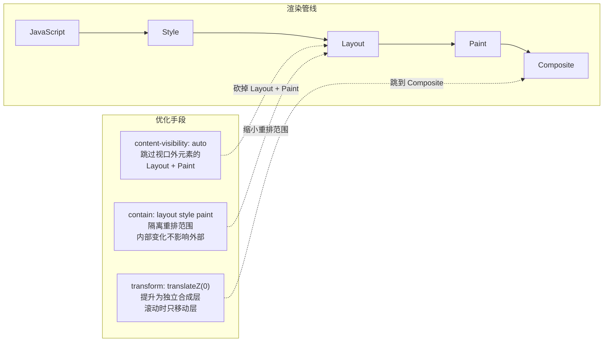
```mermaid
flowchart LR
    subgraph "渲染管线"
        direction TB
        JS[JavaScript] --> Style[Style]
        Style --> Layout[Layout]
        Layout --> Paint[Paint]
        Paint --> Composite[Composite]
    end
    
    subgraph "优化手段"
        CV["content-visibility: auto\n跳过视口外元素的\nLayout + Paint"]
        CT["contain: layout style paint\n隔离重排范围\n内部变化不影响外部"]
        TZ["transform: translateZ(0)\n提升为独立合成层\n滚动时只移动层"]
    end
    
    CV -.->|"砍掉 Layout + Paint"| Layout
    CT -.->|"缩小重排范围"| Layout
    TZ -.->|"跳到 Composite"| Composite
```

```css
/* 视口外的卡片跳过渲染 */
.game-card {
  contain: layout style paint;
  content-visibility: auto;
  contain-intrinsic-size: auto 180px;
}

/* 粘性导航栏提升到独立合成层 */
nav.sticky {
  will-change: transform;
  transform: translateZ(0);
}
```

逐个解释：

**`content-visibility: auto`** 是杀手锏。浏览器会完全跳过视口外元素的布局和绘制。一个包含 30 张比赛卡片的首页，初次渲染时浏览器只需要处理视口内的 6-8 张。

**`contain: layout style paint`** 告诉浏览器：这个元素的内部变化不会影响外部布局。浏览器可以将重排范围限制在元素内部，不必重算整个文档。

**`contain-intrinsic-size: auto 180px`** 关键在 `auto`。第一次渲染完成后，浏览器会记住元素的真实高度。用户滚动回来时不会因为高度估算错误而发生布局抖动。

**`transform: translateZ(0)`** 强制创建 GPU 合成层。粘性导航栏在滚动时会频繁触发重绘，提升到独立层后，滚动时只需要在合成阶段移动整个层的位置，跳过 Layout 和 Paint——这就是为什么 Chrome DevTools 里会看到绿色的 "Composited Layer" 标记。

所有可滚动容器也被提升到 GPU 层：

```css
.overflow-x-auto {
  -webkit-overflow-scrolling: touch;
  transform: translateZ(0);
}
```

Box Score 表格横向滚动时，不会触发主线程重绘。

---

## 0x0A PWA：添加到主屏幕即 App

`manifest.json` + Apple Web App meta tags，手机浏览器添加到主屏幕后以全屏 standalone 模式运行——没有浏览器地址栏。

为了让底部 Tab 导航不被 iPhone 的 Home Indicator 遮挡：

```css
.safe-area-bottom {
  padding-bottom: env(safe-area-inset-bottom, 0px);
}

@media (display-mode: standalone) {
  .safe-area-top {
    padding-top: env(safe-area-inset-top, 0px);
  }
}
```

`env(safe-area-inset-bottom)` 在普通浏览器里值为 0；在 standalone PWA 里自动撑开底部空间。

View Transition API 给页面切换加了 200ms 交叉淡入淡出。Safari 17.1 之前不支持，但这是渐进增强——不支持的浏览器 fallback 到普通跳转，不白屏。

---

## 0x0B 更多页面

项目不只是比分。简单过一遍其他功能：

**比赛详情** — 比分、逐节得分、胜负走势图、Box Score、投篮图、逐球回放：


手机端同样流畅：

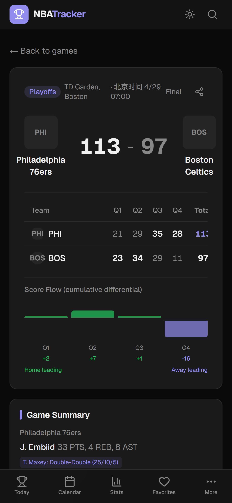

**逐球回放** — 完整时间轴，每一次得分、犯规、换人都有记录：

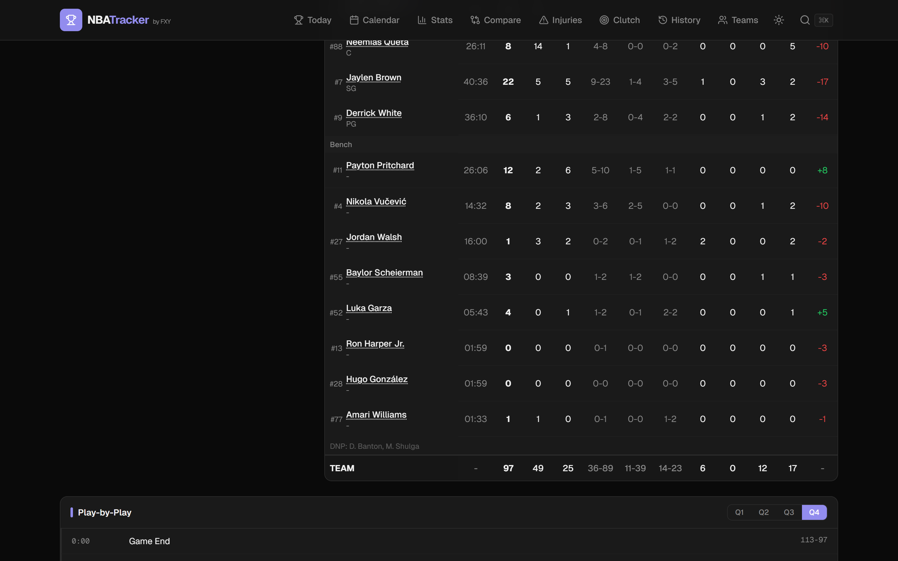

**球员档案** — 头像、选秀信息、生涯数据、本赛季场均：

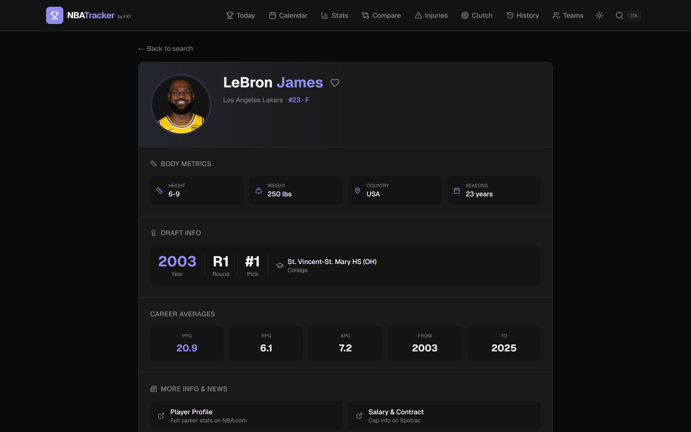

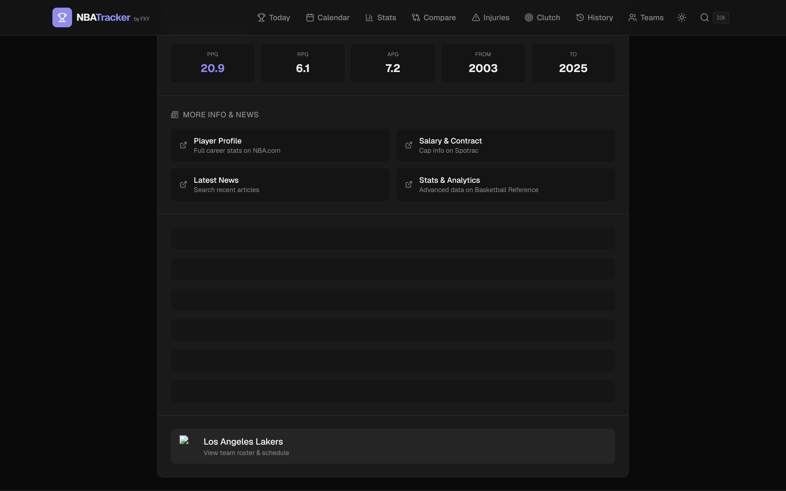

**全联盟数据排行** — 得分、篮板、助攻分类榜，支持排序：

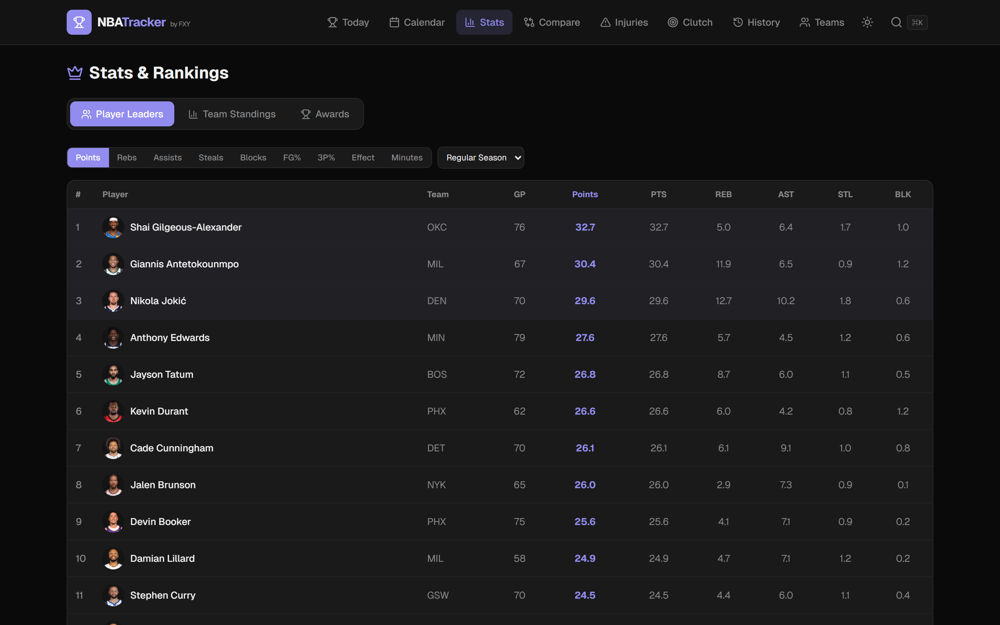

**球队主页** — 战绩、主客场拆分、近期赛程：

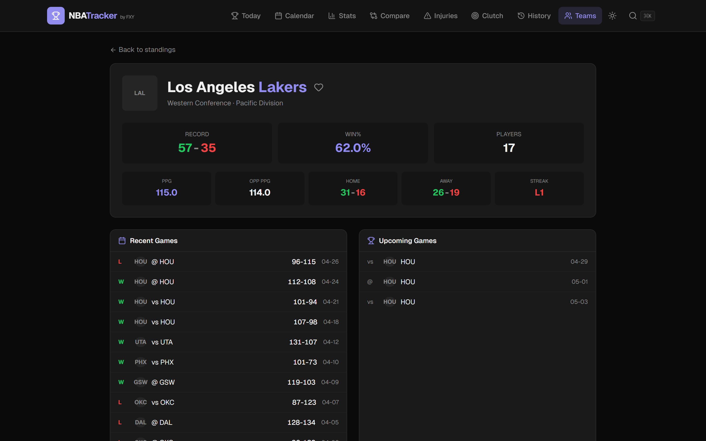

**排名** — 按分区展示，季后赛资格高亮：

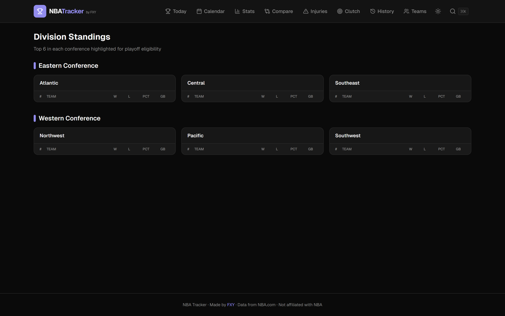

**赛程日历** — 月视图，每日比分速览：

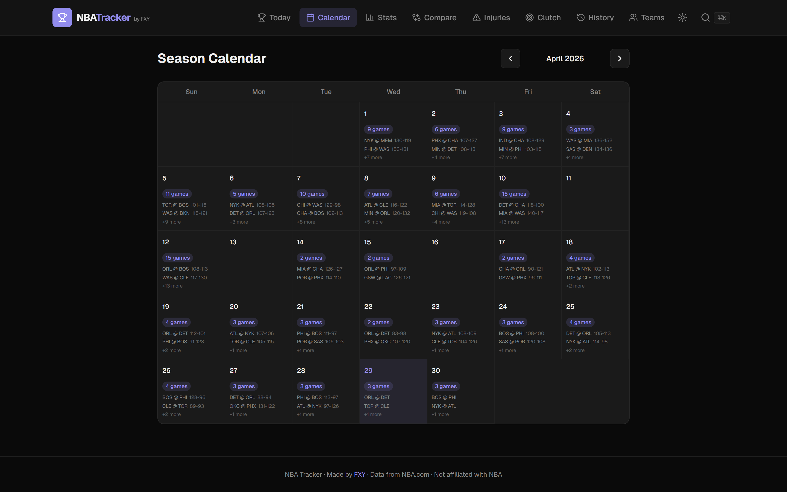

**伤病报告** — ESPN 数据源实时同步：

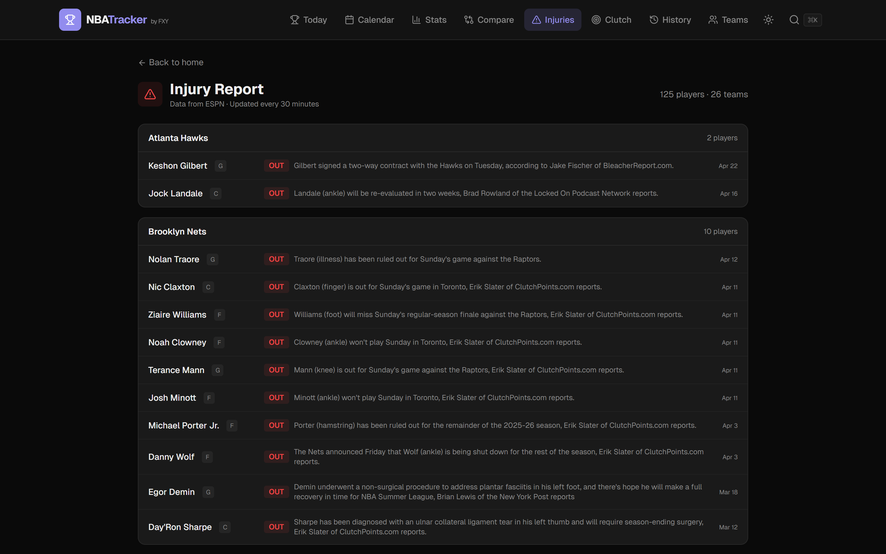

**球员搜索** — 即时搜索，头像 + 数据预览：

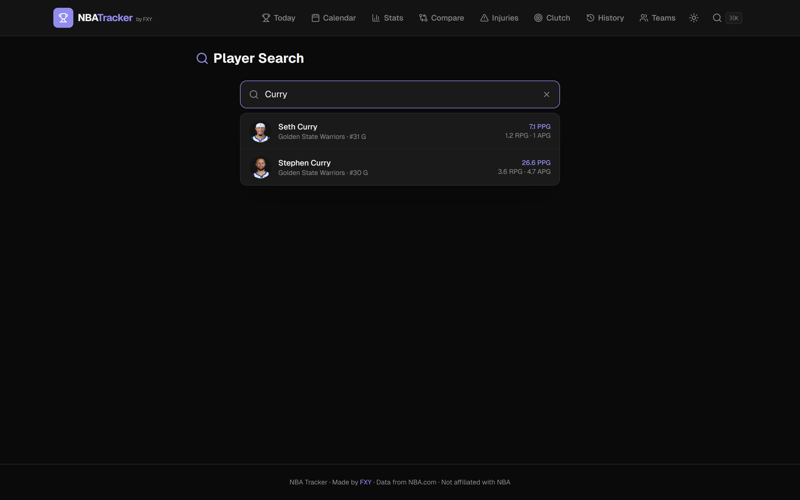

**历史数据** — 历届总冠军、MVP、得分王：

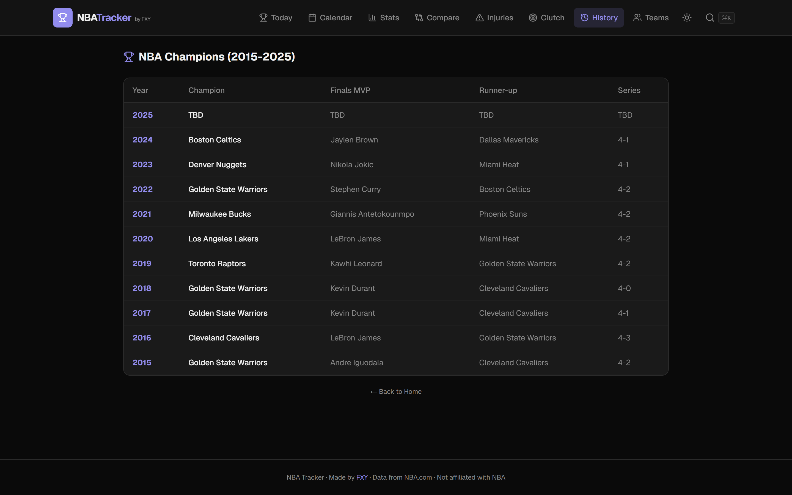

---

## 0x0C 技术栈与项目数据

```
框架       Next.js 16.2 (App Router) + React 19
语言       TypeScript 5, strict mode
样式       Tailwind CSS 4, 零 UI 库
图标       Lucide React
数据源     NBA CDN (免费) + ESPN + BallDontLie
数据库     Supabase (PostgreSQL)
部署       Vercel
代码量     8,800+ 行（纯手写 TypeScript/TSX）
组件       39 个
页面       16 个
API 路由   13 个
构建       ~4 秒
```

---

## 0x0D 踩过的坑

**Hydration Mismatch。** 主题切换用 CSS 变量 + `data-theme`，初始值从 `localStorage` 读取。服务端不知道用户选了什么主题，React 19 直接报 hydration 错误。解决：根节点加 `suppressHydrationWarning`，客户端在 `useEffect` 里延迟应用主题。首屏用默认暗色渲染，激活后瞬间切换，肉眼不可察觉。

**NBA API 的时间格式不统一。** 同一个 API 里，时钟有时候是 `PT05M30.00S`（ISO 8601 duration），有时候是 `5:30`，有时候是空字符串。每个解析函数都要处理三种情况。

**赛程日期的时区地狱。** API 返回 `04/25/2026 00:00:00`（美东时间），前端用 `2026-04-25`（ISO）。一场北京时间 4 月 26 日凌晨的比赛，在 NBA 系统里算 4 月 25 日。用 `Intl.DateTimeFormat` 指定 `America/New_York` 时区统一：

```typescript
export function formatDate(date: Date): string {
  return new Intl.DateTimeFormat("en-CA", {
    timeZone: "America/New_York",
    year: "numeric", month: "2-digit", day: "2-digit",
  }).format(date);
}
```

`en-CA` locale 的格式恰好是 `YYYY-MM-DD`，省了自己拼字符串。

**Supabase 免费 tier 冷启动。** 有时超过 5 秒。`Promise.race` + 2 秒超时彻底解决。Supabase 挂就挂，比分照常显示。

---

## 0x0E 复盘

这个项目是大一下学期课余时间断断续续写的，从一个只能看比分的小页面，迭代成了覆盖比分、数据、投篮图、交易、伤病、历史的完整平台。

几个值得记住的点：

1. **Server Component 是真的香。** 大部分页面不需要 loading 状态了。客户端组件只负责交互（筛选、轮询、主题切换），不参与数据获取。
2. **ISR + stale-while-revalidate 是体育类应用的银弹。** 30 秒 revalidate 既保证了实时性，又不会把 CDN 打爆。
3. **SVG 比 Canvas 更适合交互式数据可视化。** 200 个点的规模下 SVG 的性能完全够用，而且 hover/click/filter 免费。
4. **不要迷信第三方服务的可用性。** 任何非关键依赖都应该有超时兜底。`Promise.race` 是最简单的断路器。
5. **CSS containment 被严重低估了。** `content-visibility: auto` 一行代码就能砍掉一半的首屏渲染开销。

线上地址：**nba.xpy.me**

项目完全开源，代码在 GitHub：**github.com/fxy2026/nba-tracker**

如果觉得有意思，欢迎去 GitHub 点个 Star。也支持 Vercel 一键部署，fork 之后你可以拥有自己的 NBA 数据站。

季后赛还在打，欢迎用起来。

---

*本文采用 CC BY-NC-SA 4.0 许可协议，转载请注明出处。*
